<!-- README.md is generated from README.Rmd. Please edit that file -->

# REMOÇÕES DE CO<sub>2</sub> POR ECOSSISTEMAS FLORESTAIS BRASILEIROS (2021–2023)

Repositório de apoio ao projeto de pesquisa de mestrado com foco na
análise espacial e temporal das remoções de dióxido de carbono
(CO<sub>2</sub>) pela biomassa viva de ecossistemas florestais
brasileiros, no período de 2021 a 2023, com base em dados da plataforma
Climate [TRACE/CTrees](https://climatetrace.org/).

## 👨‍🔬 Autores

- **Pedro Barbieri Durigan**  
  Mestrando em Agronomia - Ciência do Solo - FCAV/Unesp  
  Email: [pedro.durigan@unesp.br](mailto:pedro.durigan@unesp.b)

- **Prof. Dr. Newton La Scala Júnior**  
  Coorientador — Departamento de Ciências Exatas - FCAV/Unesp  
  Email: <la.scala@unesp.br>

- **Prof. Dr. Alan Rodrigo Panosso**  
  Coorientador — Departamento de Ciências Exatas - FCAV/Unesp  
  Email: <alan.panosso@unesp.br>

## 📁 Etapas do Projeto

Os scripts abaixo foram desenvolvidos em RMarkdown e estão disponíveis
em formato HTML:

- [`01_aquisicao_dados`](https://arpanosso.github.io//mestrado-durigan-remocoes-co2//01_aquisicao_dados.html)
  – Aquisição e download dos dados brutos.  
- [`02_tratamento_dados`](https://arpanosso.github.io//mestrado-durigan-remocoes-co2//02_tratamento_dados.html)
  – Faxina, filtragem e organização dos dados.  
- [`03_pre-processamento`](https://arpanosso.github.io//mestrado-durigan-remocoes-co2//03_preprocessamento.html)
  – Preparação dos dados para análise.

## 👉 [DOWNLOAD A BASE](https://drive.google.com/file/d/1EbGu6pI62J9fTxx2roxeRx6_WL4pZsbG/view?usp=drive_link)

## 📦 **Carregando Pacotes e a Base de dados**

Importante dropar as colunas `Other` e as emissões provenientes de áreas
urbanas, uma vez que está estão incorporadas nos `source_type` igual a
`Municipality`. Para essa análise, serão consideradas apenas as remoções
e o ano até $`2024`$. Nesse caso, vamos transformar os dados de
`emission_quantity` para valores positivos de remoções.

``` r
library(tidyverse)
library(ggridges)
library(ggpubr)
library(geobr)
library(pracma)
source("R/graph-theme.R")
emission_sources_removals <- 
  read_rds("data/emissions_sources.rds") |> 
  select(!starts_with("Other")) |> 
  filter(
    source_type == "Municipality",
    subsector == "removals",
    year < 2024
    ) |> 
  mutate(
    emissions_quantity = -1*emissions_quantity,
    biomes_sig = ifelse(biomes_sig == "Other","AF",biomes_sig)
  ) |> 
  filter(
    emissions_quantity >=0
  )
```

## 🔍 **Análise Exploratória dos Dados**

Visualizações gráficas, estatísticas descritivas e inspeção de padrões
regionais e temporais. Inicialmente são carregados os polígonos do país
e dos municípios, e a área dos polígomos é calculada pela função
`areaPolygon` do pacote `{geosphere}` Esse método preserva o sistema
geográfico WGS84 e considera a curvatura da Terra, ideal para áreas
irregulares e grandes. O resultado será dado em hectares.

``` r
country_br <- read_country(showProgress = FALSE)
municipality <- read_municipality(showProgress = FALSE) |> 
  group_by(name_muni) |> 
  mutate(
    area_ha = geosphere::areaPolygon(
      geom |> pluck(1) |> as.matrix()) / 10000
  ) |> 
  ungroup() |> 
  left_join( read_rds("data/df_nome.rds") |> 
  select(id_municipio, nome_regiao) |> 
  rename(code_muni = id_municipio) |> 
    mutate(code_muni = as.numeric(code_muni)),
  by = "code_muni")
```

Agora vamos incorporar a área ao banco de dados, criando um novo objeto.

``` r
emission_sources_removals_ha <- emission_sources_removals |> 
  left_join(
    municipality |> 
      as_tibble() |> 
      select(name_muni, area_ha) |> 
      rename(muni = name_muni),  by = "muni",
    relationship = "many-to-many") |> 
  group_by(year, muni) |> 
  mutate(
    emissions_quantity_ha = (emissions_quantity)/area_ha
  )
```

Imagens dos pontos classificados por bioma

``` r
country_br |> 
    ggplot() + 
    geom_sf(fill="white", color="black",
          size=.15, show.legend = FALSE) +
    geom_point( data = emission_sources_removals_ha |> 
       filter(year == 2023),
       aes(lon,lat,colour = biomes_sig))+
    labs(x="Longitude", y="Latitude")+
    graph_theme()
```

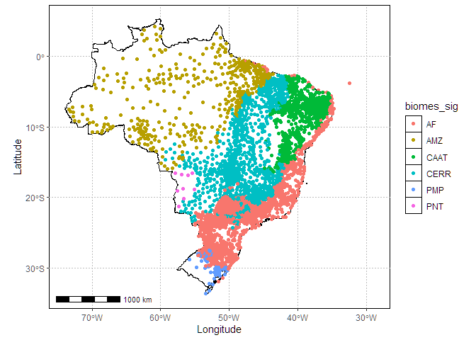<!-- -->

Criando a tabela da estatística descritiva para as remoções (M t
CO<sub>2</sub>e) e **exportanto a tabela para pasta** `output`

``` r
emission_sources_removals_ha  |> 
  mutate(
  #   fct_year = fct_rev(as.factor(year)),
  #   classe = ifelse(tratamento ==
  #            "UC_desm" | tratamento == "TI_desm",
  #                   "Des","Con")
  )  |> 
  ggplot(aes(y=as_factor(year))) +
  geom_density_ridges(rel_min_height = 0.03,
                      aes(x=emissions_quantity_ha, fill=as_factor(year)),
                      alpha = .6, color = "black"
  ) +
  scale_fill_viridis_d() +
  theme_ridges() +
  coord_cartesian(xlim=c(-1,10.5e-1)) +
  geom_vline(xintercept = 0, colour="black") +
  labs(x = expression(paste("Removal ( t ",CO[2],"e)")), # ATUALIZAR
       y = "Year") +
  theme(
    legend.position = ""
  )
```

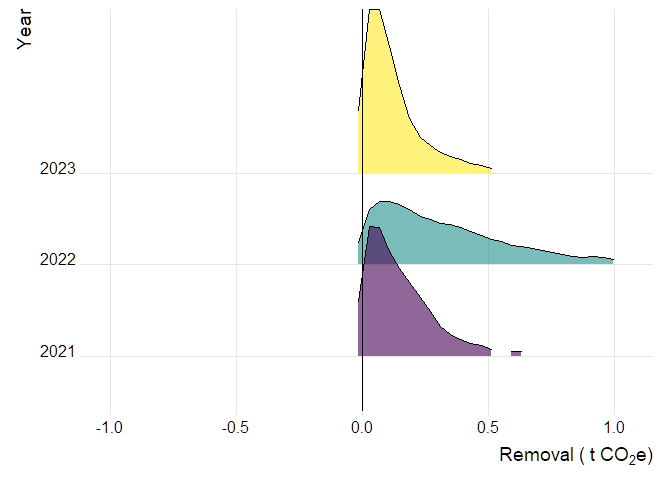<!-- -->

``` r
emission_sources_removals_ha  |> 
  mutate(
  #   fct_year = fct_rev(as.factor(year)),
  #   classe = ifelse(tratamento ==
  #            "UC_desm" | tratamento == "TI_desm",
  #                   "Des","Con")
  )  |> 
  ggplot(aes(y=as_factor(year))) +
  geom_density_ridges(rel_min_height = 0.03,
                      aes(x=emissions_quantity_ha, fill=as_factor(biomes_sig)),
                      alpha = .6, color = "black"
  ) +
  scale_fill_viridis_d(option = "inferno") +
  theme_ridges() +
  coord_cartesian(xlim=c(-1,1)) +
  geom_vline(xintercept = 0, colour="red") +
  labs(x = expression(paste("Removal ( t ",CO[2],"e)")),
       y = "Year",fill="Biome") 
```

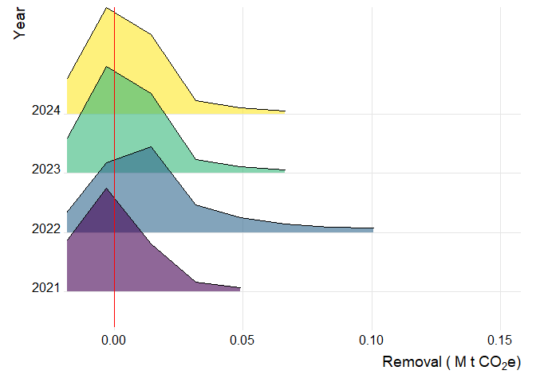<!-- -->

``` r
emission_sources_removals_ha |> 
  group_by(year, biomes_sig) |> 
  summarise(
    sum_removal = sum(emissions_quantity_ha,na.rm = TRUE),
  ) |> 
  ggplot(aes(x=year,y=sum_removal, fill = biomes_sig)) +
  geom_col(color="black") +
  scale_fill_viridis_d(option = "inferno") +
  theme_bw()
```

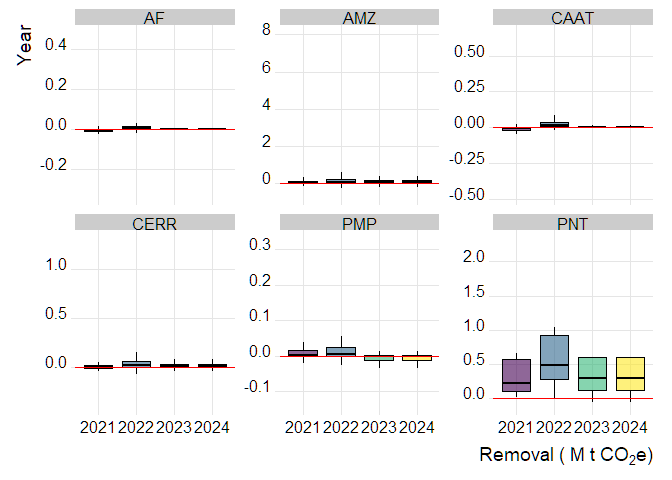<!-- -->

``` r
emission_sources_removals_ha |> 
  group_by(year, biomes_sig) |> 
  summarise(
    sum_removal = sum(emissions_quantity,na.rm = TRUE),
    sum_ha = sum(area_ha, na.rm=TRUE)
  ) |> 
  ggplot(aes(x=year,y=sum_ha, fill = biomes_sig)) +
  geom_col(color="black") +
  scale_fill_viridis_d(option = "inferno") +
  theme_bw()
```

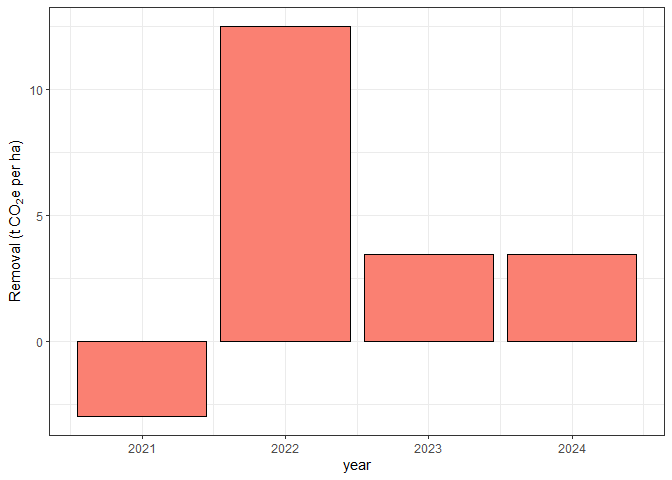<!-- -->

``` r
emission_sources_removals_ha |> 
  group_by(year, biomes_sig) |> 
  summarise(
    sum_removal = sum(emissions_quantity,na.rm = TRUE),
    sum_ha = sum(area_ha, na.rm=TRUE),
    .groups = "drop"
  ) |> 
  mutate(sum_removal_ha = sum_removal/sum_ha *1000) |> 
  ggplot(aes(x=year,y=sum_removal_ha, fill = biomes_sig)) +
  geom_col(color="black") +
  scale_fill_viridis_d(option = "inferno") +
  labs(x="Year", fill="Biome",
        y = expression(
     paste("Removal ( kg ",CO[2],"e)"))
    ) +
  theme_bw()
```

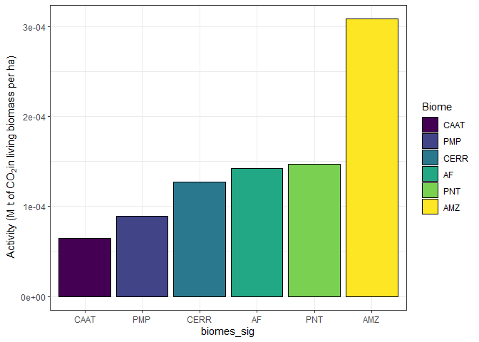<!-- -->

``` r
tab_stat <- emission_sources_removals_ha |> 
  group_by(year, biomes_sig) |> 
  summarise(
    sum_removal = sum(emissions_quantity,na.rm = TRUE),
    sum_ha = sum(area_ha, na.rm=TRUE)
  ) |> 
  mutate(sum_removal_ha = sum_removal/sum_ha*1000)
writexl::write_xlsx(tab_stat,"output/est-removals-ha-biome.xlsx")
tab_stat
#> # A tibble: 18 × 5
#> # Groups:   year [3]
#>     year biomes_sig sum_removal      sum_ha sum_removal_ha
#>    <dbl> <chr>            <dbl>       <dbl>          <dbl>
#>  1  2021 AF           50332051.  773500145.           65.1
#>  2  2021 AMZ         781794475. 4863993091.          161. 
#>  3  2021 CAAT         12417626.  202668507.           61.3
#>  4  2021 CERR        240920154. 1668431756.          144. 
#>  5  2021 PMP          32271138.  168243184.          192. 
#>  6  2021 PNT          33861455.  214433404.          158. 
#>  7  2022 AF          501203201. 1573907747.          318. 
#>  8  2022 AMZ        1715879494. 4929796265.          348. 
#>  9  2022 CAAT        516414784. 1413441928.          365. 
#> 10  2022 CERR        894494730. 2316405961.          386. 
#> 11  2022 PMP          43612245.  179011937.          244. 
#> 12  2022 PNT          80814206.  214025159.          378. 
#> 13  2023 AF           89621261. 1500091514.           59.7
#> 14  2023 AMZ        1078061040. 5146429396.          209. 
#> 15  2023 CAAT         70465080.  794201030.           88.7
#> 16  2023 CERR        486105862. 2438313313.          199. 
#> 17  2023 PMP           4964424.   77631575.           63.9
#> 18  2023 PNT          57668709.  194082613.          297.
```

Mapas das remoções

``` r
map(2021:2023,~{
municipality |> 
  # filter(abbrev_state == "MG") |> 
  left_join(
    emission_sources_removals_ha |> 
            filter(
              # state == "MG",
              year == .x) |> 
              group_by(muni) |> 
              summarise(
                emissions_quantity = mean(emissions_quantity_ha)
              ) |> 
      rename(name_muni = muni),
    by = "name_muni") |> 
  mutate(emissions_quantity = ifelse(is.na(emissions_quantity),
                                        median(emissions_quantity,na.rm=TRUE),
                                        emissions_quantity)) |> 
  ggplot() +
  geom_sf(aes(fill=emissions_quantity), color="transparent",
             size=.05, show.legend = TRUE) +
  scale_fill_viridis_c(
    limits = c(0, 10),   # mesma escala
      # oob = scales::squish   # evita que valores fora da faixa quebrem
  ) +
  labs(title = .x,
       fill = "Removals") +
  graph_theme()}
)
#> [[1]]
```

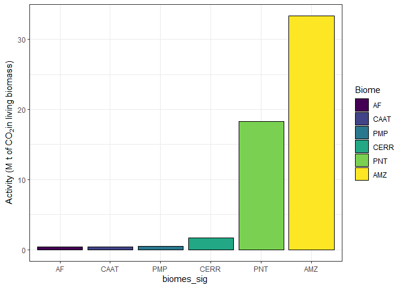<!-- -->

    #> 
    #> [[2]]

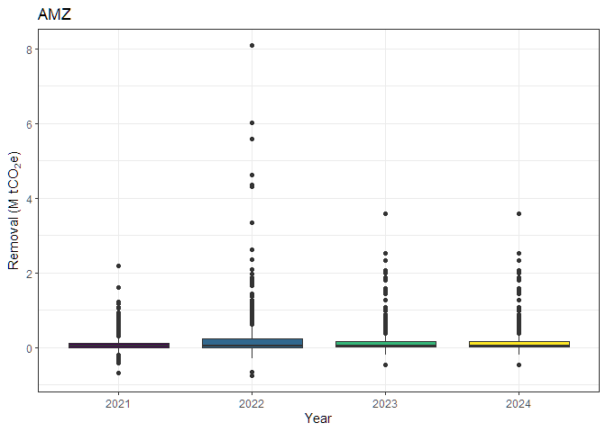<!-- -->

    #> 
    #> [[3]]

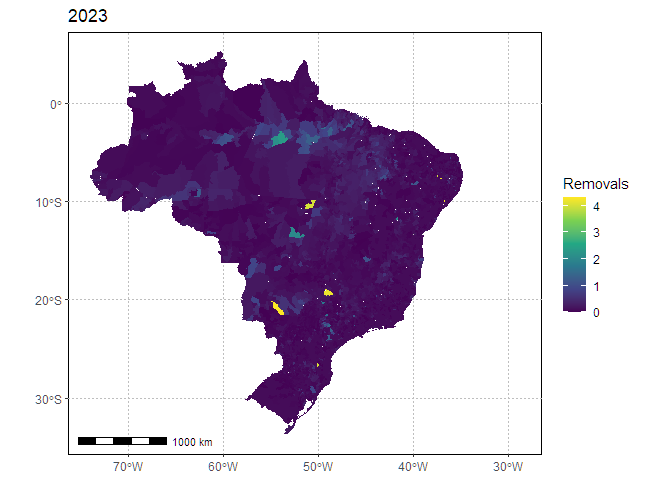<!-- -->

``` r
biomes <- emission_sources_removals_ha$biomes_sig |> unique()
map(biomes, ~{
  emission_sources_removals_ha |> 
    filter(biomes_sig == .x) |> 
    ggplot(aes(x=as_factor(year),y=emissions_quantity/1e6,
               fill = as_factor(year))) +
    geom_boxplot()+
    # geom_violin(trim = FALSE,
    #             draw_quantiles = c( 0.5),
    #             color="black") +
    theme_bw() +
    # ylim(-5e4,1e5) +
    theme(
      legend.position = ""
    ) +
    scale_fill_viridis_d()+
    labs(title = .x,
         y=expression(paste("Removal (M t ",CO[2],"e)")),
         x="Year")
})
#> [[1]]
```

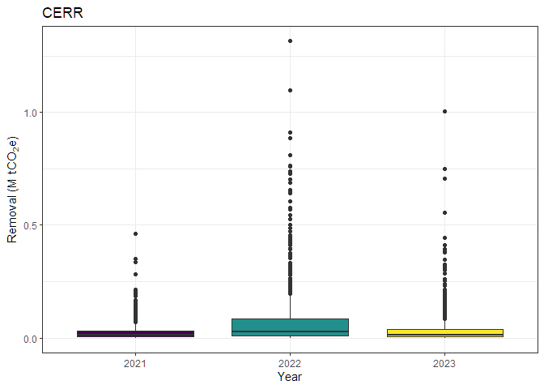<!-- -->

    #> 
    #> [[2]]

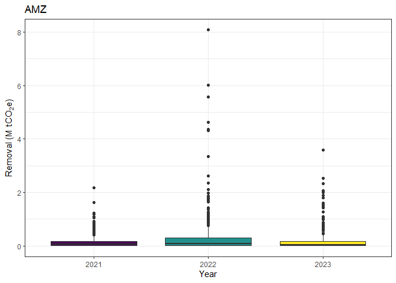<!-- -->

    #> 
    #> [[3]]

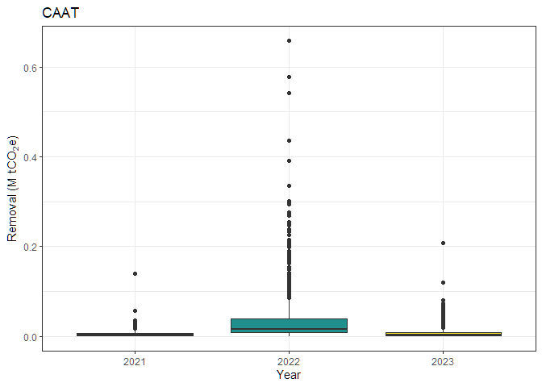<!-- -->

    #> 
    #> [[4]]

<!-- -->

    #> 
    #> [[5]]

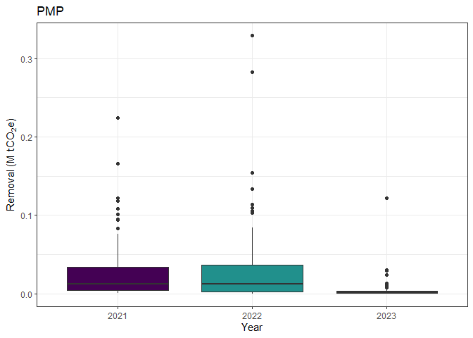<!-- -->

    #> 
    #> [[6]]

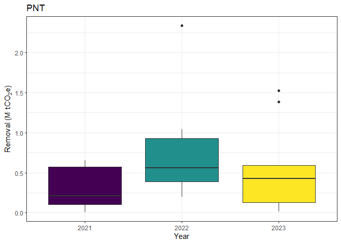<!-- -->

``` r
emission_sources_removals_ha |> 
  mutate(emissions_quantity = emissions_quantity/1e6) |> 
  group_by(year,biomes_sig) |> 
  summarise(
    Sum = mean(emissions_quantity_ha, na.rm = TRUE)) |> 
    ggplot(aes(x=year,y=Sum,fill = biomes_sig)) +
    geom_col(position = "dodge",color="black")+
    theme_bw() +
  scale_fill_viridis_d() +
    labs(fill = "Biome",
         y=expression(paste("Removal (M t ",CO[2],"e)")),
         x="Year")
```

<!-- -->

Criando a tabela da estatística descritiva para as remoções por hectare
e **exportanto a tabela para pasta** `output`.

``` r
tab_stat <- emission_sources_removals_ha |> 
  group_by(year) |> 
  summarise(
    Sum = sum(emissions_quantity_ha, na.rm = TRUE),
    Mean = mean(emissions_quantity_ha, na.rm = TRUE),
    Median = median(emissions_quantity_ha, na.rm = TRUE),
    SD = sd(emissions_quantity_ha, na.rm = TRUE),
    SSE = SD/sqrt(n()),
    Min = min(emissions_quantity_ha, na.rm = TRUE),
    Max = max(emissions_quantity_ha, na.rm = TRUE),
    Skw = agricolae::skewness(emissions_quantity_ha),
    Krt = agricolae::kurtosis(emissions_quantity_ha)
  )
writexl::write_xlsx(tab_stat,"output/est-removals_ha.xlsx")
tab_stat
#> # A tibble: 3 × 10
#>    year    Sum  Mean Median    SD     SSE   Min   Max   Skw   Krt
#>   <dbl>  <dbl> <dbl>  <dbl> <dbl>   <dbl> <dbl> <dbl> <dbl> <dbl>
#> 1  2021  5354. 0.201 0.123  0.354 0.00215     0  5.28  7.87  85.8
#> 2  2022 27689. 0.439 0.288  0.813 0.00319     0 20.5  13.9  282. 
#> 3  2023  8068. 0.160 0.0888 0.370 0.00164     0  8.29 14.1  272.
```

Gráfico das remoções por ha

``` r
tab_stat |> 
  ggplot(aes(x=year, y=Mean)) +
  geom_col(color="black",fill="salmon") +
  labs(y = expression(paste("Removal (t ",CO[2],"e per ha )"))) +
  theme_bw()
```

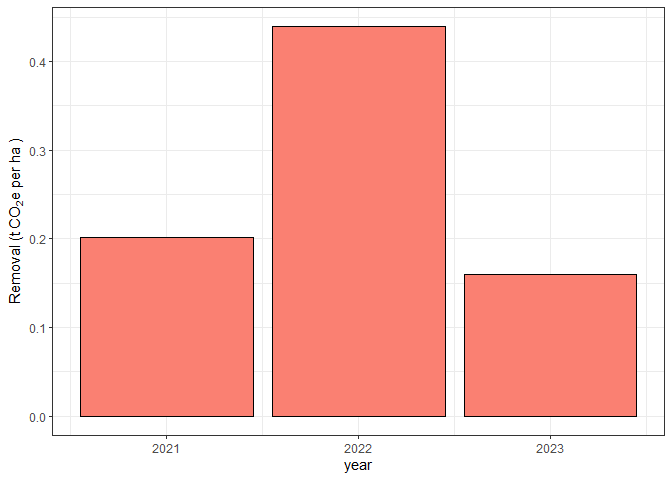<!-- -->

``` r
emission_sources_removals_ha |> 
  # mutate(emissions_quantity = emissions_quantity_ha) |> 
  group_by(year,biomes_sig) |> 
  summarise(
    Mean = mean(emissions_quantity_ha, na.rm = TRUE)) |> 
    ggplot(aes(x=year,y=Mean,fill = biomes_sig)) +
    geom_col(position = "dodge",color="black")+
    theme_bw() +
  scale_fill_viridis_d() +
    labs(fill = "Biome",
         y=expression(paste("Removal ( t ",CO[2],"e ", ha^{-1},")")),
         x="Year")
```

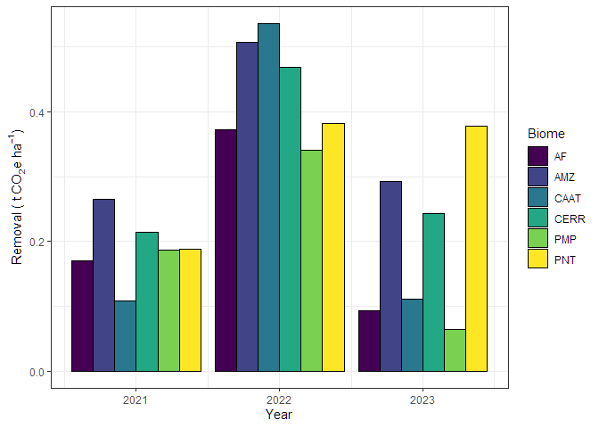<!-- -->

``` r
abbrev_region <- municipality |> select(nome_regiao) |> 
  drop_na() |> pull(nome_regiao)|>  unique()
reg_year <- paste0(abbrev_region," ",rep(2021:2023,rep(5,3)))

map(reg_year,~{
  regi <- str_split(.x[1]," ", simplify = TRUE)[1,1] 
  ano <- str_split(.x[1]," ", simplify = TRUE)[1,2] 
municipality |> 
  filter(nome_regiao == regi) |> 
  left_join(
    emission_sources_removals_ha |> 
            filter(
              region == regi,
              year == ano) |> 
              group_by(muni) |> 
              summarise(
                emissions_quantity_ha = mean(emissions_quantity_ha)
              ) |> 
      rename(name_muni = muni),
    by = "name_muni") |> 
  mutate(emissions_quantity_ha = ifelse(is.na(emissions_quantity_ha),
                                        median(emissions_quantity_ha,na.rm=TRUE),
                                        emissions_quantity_ha)) |> 
  ggplot() +
  geom_sf(aes(fill=emissions_quantity_ha), color="transparent",
             size=.05, show.legend = TRUE) +
  scale_fill_viridis_c() +
  labs(title = .x) +
  graph_theme()}
)
#> [[1]]
```

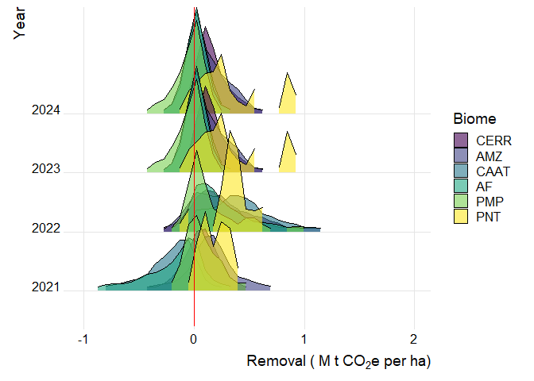<!-- -->

    #> 
    #> [[2]]

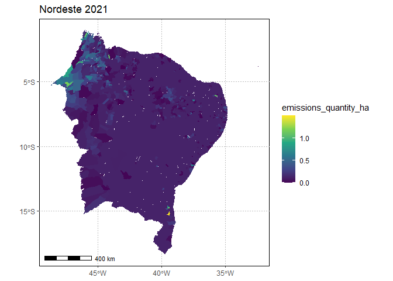<!-- -->

    #> 
    #> [[3]]

<!-- -->

    #> 
    #> [[4]]

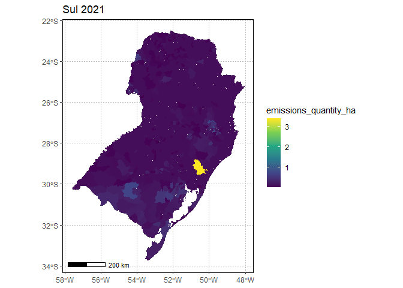<!-- -->

    #> 
    #> [[5]]

<!-- -->

    #> 
    #> [[6]]

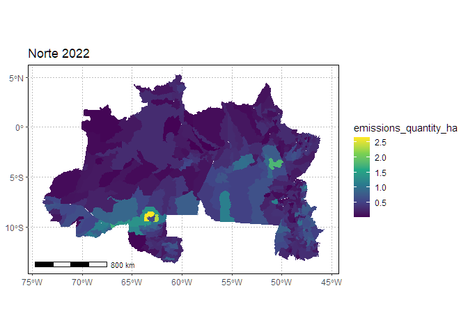<!-- -->

    #> 
    #> [[7]]

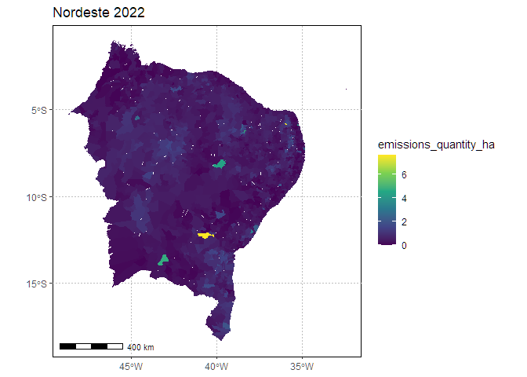<!-- -->

    #> 
    #> [[8]]

<!-- -->

    #> 
    #> [[9]]

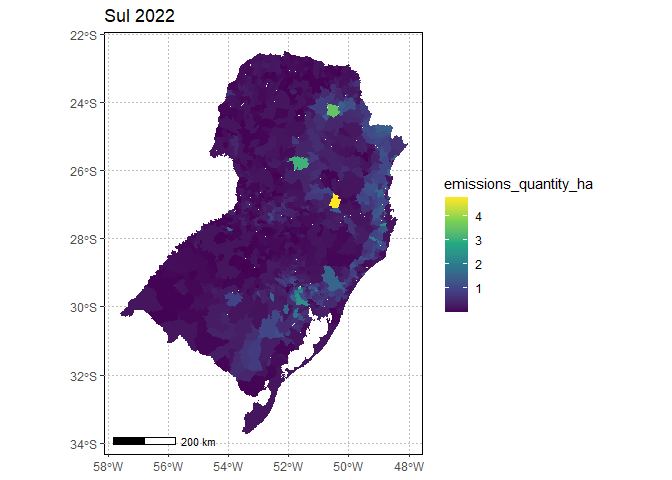<!-- -->

    #> 
    #> [[10]]

<!-- -->

    #> 
    #> [[11]]

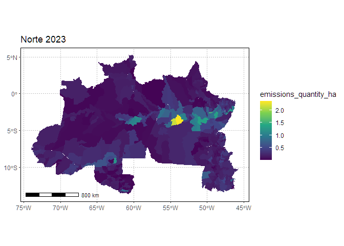<!-- -->

    #> 
    #> [[12]]

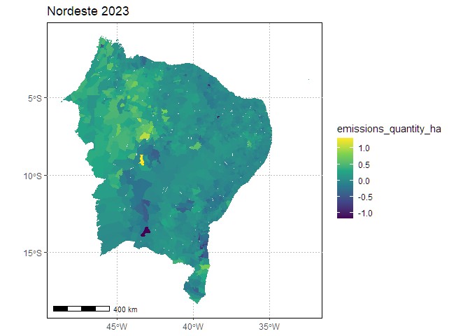<!-- -->

    #> 
    #> [[13]]

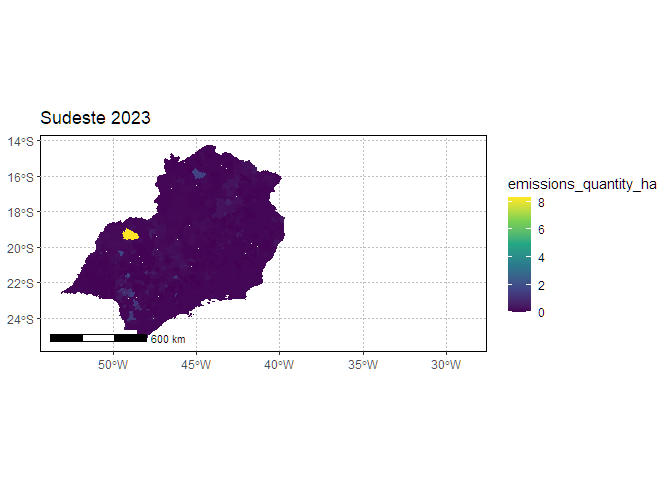<!-- -->

    #> 
    #> [[14]]

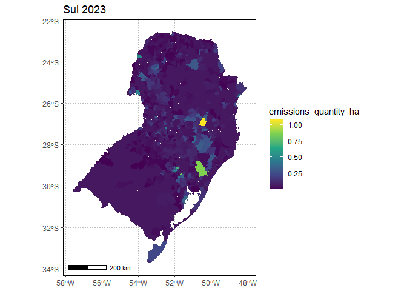<!-- -->

    #> 
    #> [[15]]

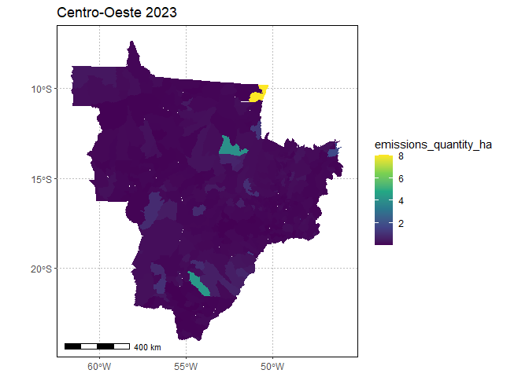<!-- -->

``` r
emission_sources_removals_ha  |> 
  mutate(
  #   fct_year = fct_rev(as.factor(year)),
  #   classe = ifelse(tratamento ==
  #            "UC_desm" | tratamento == "TI_desm",
  #                   "Des","Con")
  )  |> 
  ggplot(aes(y=as_factor(year))) +
  geom_density_ridges(rel_min_height = 0.03,
                      aes(x=emissions_quantity_ha/1e6, fill=as_factor(year)),
                      alpha = .6, color = "black"
  ) +
  scale_fill_viridis_d() +
  theme_ridges() +
  coord_cartesian(xlim=c(-1e-6,1e-6)) +
  geom_vline(xintercept = 0, colour="red") +
  labs(x = expression(paste("Removal ( M t ",CO[2],"e per ha)")),
       y = "Year") +
  theme(
    legend.position = ""
  )
```

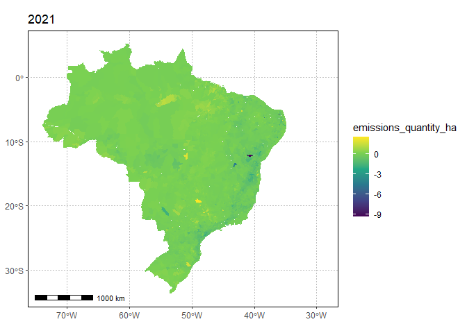<!-- -->

``` r
emission_sources_removals_ha  |> 
  mutate(
  #   fct_year = fct_rev(as.factor(year)),
  #   classe = ifelse(tratamento ==
  #            "UC_desm" | tratamento == "TI_desm",
  #                   "Des","Con")
  )  |> 
  ggplot(aes(y=as_factor(year))) +
  geom_density_ridges(rel_min_height = 0.03,
                      aes(x=emissions_quantity_ha, fill=as_factor(biomes_sig)),
                      alpha = .6, color = "black"
  ) +
  scale_fill_viridis_d() +
  theme_ridges() +
  coord_cartesian(xlim=c(-1,2)) +
  geom_vline(xintercept = 0, colour="red") +
  labs(x = expression(paste("Removal ( M t ",CO[2],"e per ha)")),
       y = "Year",fill="Biome") 
```

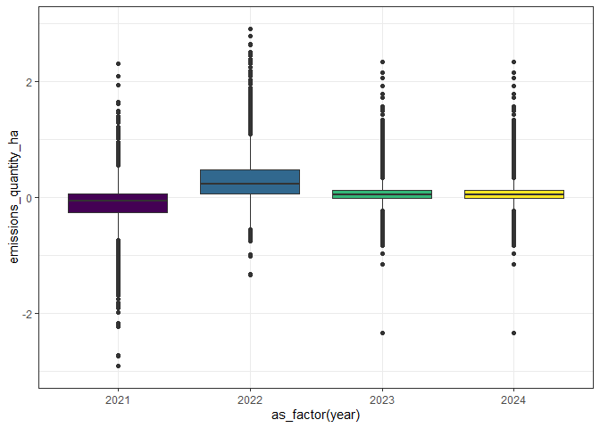<!-- -->

``` r
map(2021:2024,~{
municipality |> 
  # filter(abbrev_state == "MG") |> 
  left_join(
    emission_sources_removals_ha |> 
            filter(
              # state == "MG",
              year == .x) |> 
              group_by(muni) |> 
              summarise(
                emissions_quantity_ha = mean(emissions_quantity_ha)
              ) |> 
      rename(name_muni = muni),
    by = "name_muni") |> 
  mutate(emissions_quantity_ha = ifelse(is.na(emissions_quantity_ha),
                                        median(emissions_quantity_ha,na.rm=TRUE),
                                        emissions_quantity_ha)) |> 
  ggplot() +
  geom_sf(aes(fill=emissions_quantity_ha), color="transparent",
             size=.05, show.legend = TRUE) +
  scale_fill_viridis_c() +
  labs(title = .x) +
  graph_theme()}
)
#> [[1]]
```

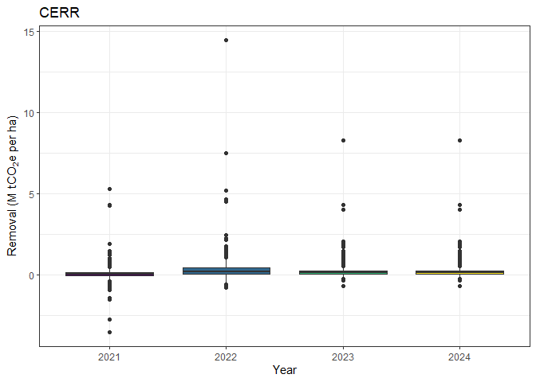<!-- -->

    #> 
    #> [[2]]

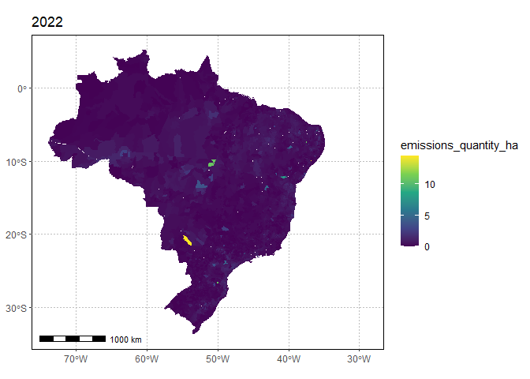<!-- -->

    #> 
    #> [[3]]

<!-- -->

    #> 
    #> [[4]]

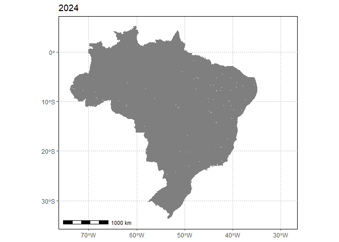<!-- -->

``` r
emission_sources_removals_ha |> 
  ggplot(aes(x=as_factor(year),y=emissions_quantity_ha,
             fill = as_factor(year))) +
  geom_boxplot()+
  # geom_violin(trim = FALSE,
  #             draw_quantiles = c( 0.5),
  #             color="black") +
  theme_bw() +
  ylim(-3,3) +
  theme(
    legend.position = ""
  ) +
  scale_fill_viridis_d()
```

<!-- -->

``` r
biomes <- emission_sources_removals_ha$biomes_sig |> unique()
map(biomes, ~{
  emission_sources_removals_ha |> 
    filter(biomes_sig == .x) |> 
    ggplot(aes(x=as_factor(year),y=emissions_quantity_ha,
               fill = as_factor(year))) +
    geom_boxplot()+
    # geom_violin(trim = FALSE,
    #             draw_quantiles = c( 0.5),
    #             color="black") +
    theme_bw() +
    # ylim(-5e4,1e5) +
    theme(
      legend.position = ""
    ) +
    scale_fill_viridis_d()+
    labs(title = .x,
         y=expression(paste("Removal (M t ",CO[2],"e per ha)")),
         x="Year")
})
#> [[1]]
```

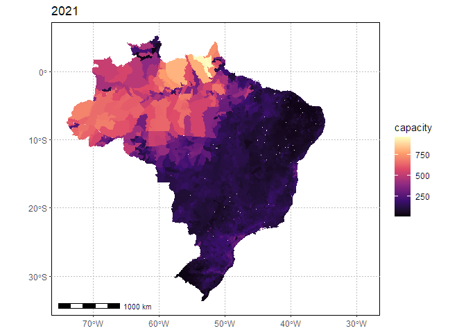<!-- -->

    #> 
    #> [[2]]

<!-- -->

    #> 
    #> [[3]]

<!-- -->

    #> 
    #> [[4]]

<!-- -->

    #> 
    #> [[5]]

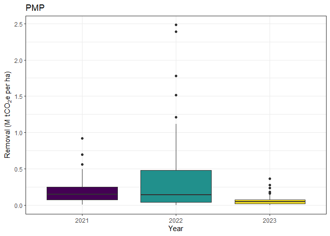<!-- -->

    #> 
    #> [[6]]

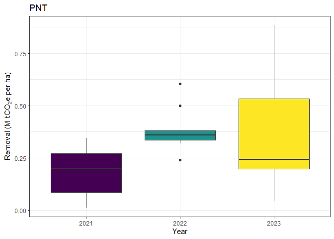<!-- -->

``` r
emission_sources_removals_ha |> 
  group_by(year,biomes_sig) |> 
  summarise(
    Mean = mean(emissions_quantity_ha, na.rm = TRUE)) |> 
    ggplot(aes(x=year,y=Mean,fill = biomes_sig)) +
    geom_col(position = "dodge",color="black")+
    theme_bw() +
  scale_fill_viridis_d()
```

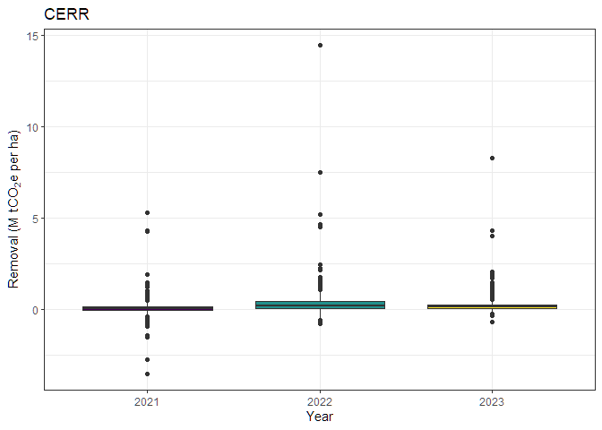<!-- -->

Criando a tabela da estatística descritiva para activity e **exportanto
a tabela para pasta** `output`

``` r
# tab_stat <- emission_sources_removals |> 
#   group_by(biomes_sig) |> 
#   summarise(
#     # Sum = sum(activity, na.rm = TRUE),
#     Mean = mean(activity, na.rm = TRUE),
#     Median = median(activity, na.rm = TRUE),
#     SD = sd(activity, na.rm = TRUE),
#     SSE = SD/sqrt(n()),
#     Min = min(activity, na.rm = TRUE),
#     Max = max(activity, na.rm = TRUE),
#     Skw = agricolae::skewness(activity),
#     Krt = agricolae::kurtosis(activity)
#   )
# writexl::write_xlsx(tab_stat,"output/est-activity.xlsx")
```

Gráfico de activity

``` r
# tab_stat |> 
#   mutate(
#     biomes_sig = fct_reorder(biomes_sig, Mean)
#   ) |> 
#   ggplot(aes(x=biomes_sig, y=Mean/1e6,fill=biomes_sig)) +
#   geom_col(color="black",position = "dodge") +
#   labs(y = expression(paste("Activity (M t of  ", CO[2],"in living biomass)")),
#                             fill = "Biome") +
#   scale_fill_viridis_d() +
#   theme_bw()
```

``` r
# map(2021:2023,~{
# municipality |> 
#   # filter(abbrev_state == "MG") |> 
#   left_join(
#     emission_sources_removals_ha |> 
#             filter(
#               # state == "MG",
#               year == .x) |> 
#               group_by(muni) |> 
#               summarise(
#                 activity = mean(activity)
#               ) |> 
#       rename(name_muni = muni),
#     by = "name_muni") |> 
#   mutate(activity = ifelse(is.na(activity),
#                                         median(activity,na.rm=TRUE),
#                                         activity)) |> 
#   ggplot() +
#   geom_sf(aes(fill=activity), color="transparent",
#              size=.05, show.legend = TRUE) +
#   scale_fill_viridis_c() +
#   labs(title = .x) +
#   graph_theme()}
# )
```

Criando a tabela da estatística descritiva para capacity e **exportanto
a tabela para pasta** `output`

``` r
# tab_stat <- emission_sources_removals |> 
#   group_by(biomes_sig) |> 
#   summarise(
#     # Sum = sum(capacity, na.rm = TRUE),
#     Mean = mean(capacity, na.rm = TRUE),
#     Median = median(capacity, na.rm = TRUE),
#     SD = sd(capacity, na.rm = TRUE),
#     SSE = SD/sqrt(n()),
#     Min = min(capacity, na.rm = TRUE),
#     Max = max(capacity, na.rm = TRUE),
#     Skw = agricolae::skewness(capacity),
#     Krt = agricolae::kurtosis(capacity)
#   )
# writexl::write_xlsx(tab_stat,"output/est-capacity.xlsx")
```

Gráfico de capacity

``` r
# tab_stat |> 
#   mutate(
#     biomes_sig = fct_reorder(biomes_sig, Mean)
#   ) |> 
#   ggplot(aes(x=biomes_sig, y=Mean/1e6,fill=biomes_sig)) +
#   geom_col(color="black",position = "dodge") +
#   labs(y = expression(paste("Capacity (M t of  ", CO[2]," in living biomass per ha)")),
#                             fill = "Biome") +
#   scale_fill_viridis_d() +
#   theme_bw()
```

``` r
# map(2021:2024,~{
# municipality |> 
#   # filter(abbrev_state == "MG") |> 
#   left_join(
#     emission_sources_removals_ha |> 
#             filter(
#               # state == "MG",
#               year == .x) |> 
#               group_by(muni) |> 
#               summarise(
#                 capacity = mean(capacity)
#               ) |> 
#       rename(name_muni = muni),
#     by = "name_muni") |> 
#   mutate(capacity = ifelse(is.na(capacity),
#                                         median(capacity,na.rm=TRUE),
#                                         capacity)) |> 
#   ggplot() +
#   geom_sf(aes(fill=capacity), color="transparent",
#              size=.05, show.legend = TRUE) +
#   scale_fill_viridis_c(option = "magma") +
#   labs(title = .x) +
#   graph_theme()}
# )
```

## 🧪 **Estatística Multivariada**

Técnicas como Análise de Componentes Principais (PCA), agrupamentos
(clustering) e correlações espaciais.

### Regressão linear entre remoções e capacitu_factor

``` r
emission_sources_removals_ha |> 
  ggplot(aes(x=capacity_factor, y = emissions_quantity,
             color = biomes_sig)) +
  geom_point() + 
  facet_wrap(~year, ncol=2,scal="free") +
  theme_bw()
```

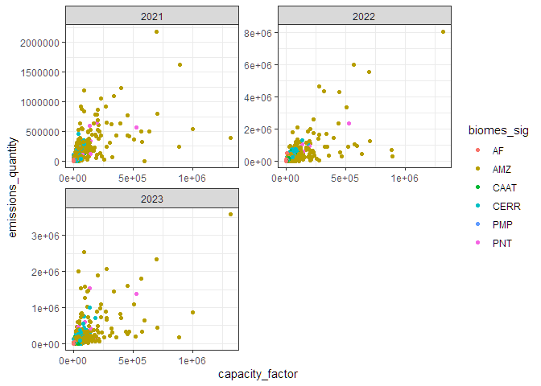<!-- -->

``` r
my_biomes <- emission_sources_removals_ha |> 
  pull(biomes_sig) |> 
  unique()

map(my_biomes, ~{emission_sources_removals_ha |> 
  filter(year == 2021,
         biomes_sig == .x) |> 
  ggscatter(
    x = "capacity_factor", y = "emissions_quantity",
    add = "reg.line", color="red",title = paste0(.x,"-2021")
  ) + # coord_cartesian(ylim = c(382.5,392))+
  # stat_cor() + #label.y = 8E6, label.x = 0
  stat_regline_equation(position = "jitter") +
  labs(y="")})
#> [[1]]
```

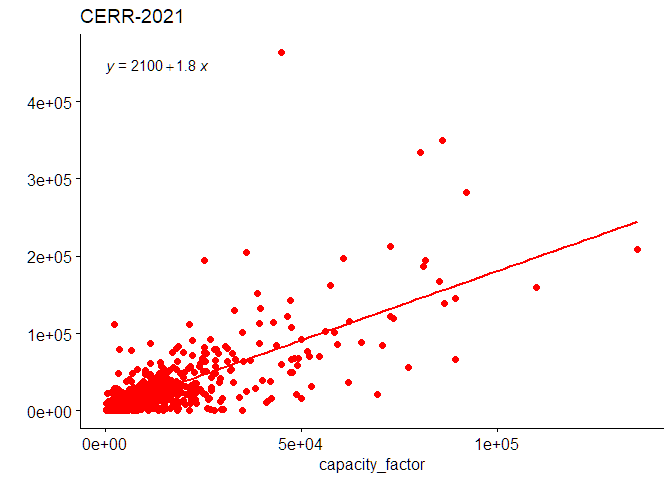<!-- -->

    #> 
    #> [[2]]

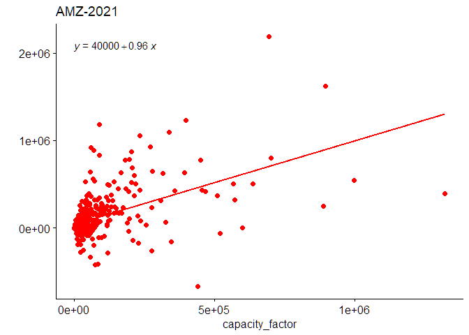<!-- -->

    #> 
    #> [[3]]

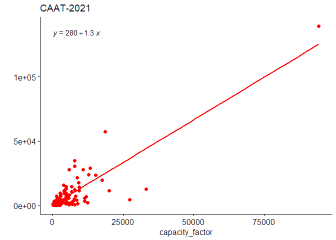<!-- -->

    #> 
    #> [[4]]

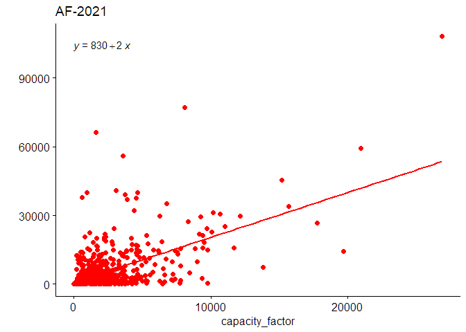<!-- -->

    #> 
    #> [[5]]

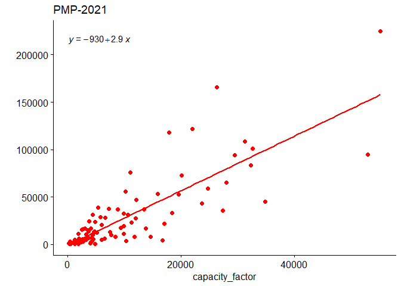<!-- -->

    #> 
    #> [[6]]

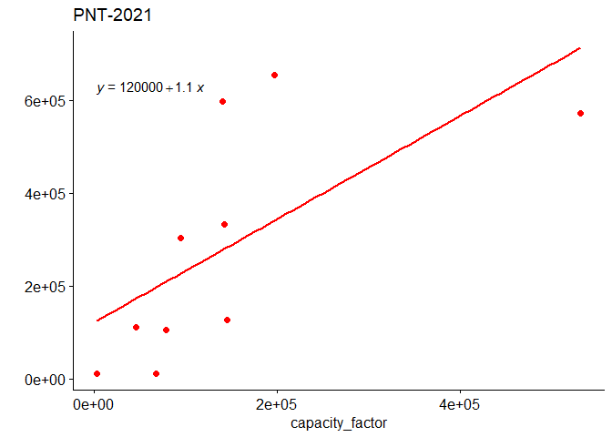<!-- -->

``` r
map(my_biomes, ~{emission_sources_removals_ha |> 
  filter(year == 2022,
         biomes_sig == .x) |> 
  ggscatter(
    x = "capacity_factor", y = "emissions_quantity",
    add = "reg.line", color="aquamarine4",title = paste0(.x,"-2021")
  ) + # coord_cartesian(ylim = c(382.5,392))+
  # stat_cor() + #label.y = 8E6, label.x = 0
  stat_regline_equation() +
  labs(y="")})
#> [[1]]
```

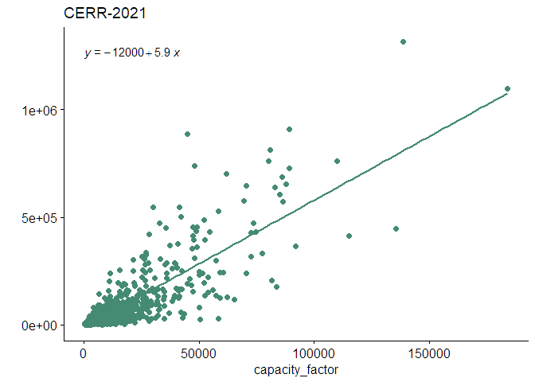<!-- -->

    #> 
    #> [[2]]

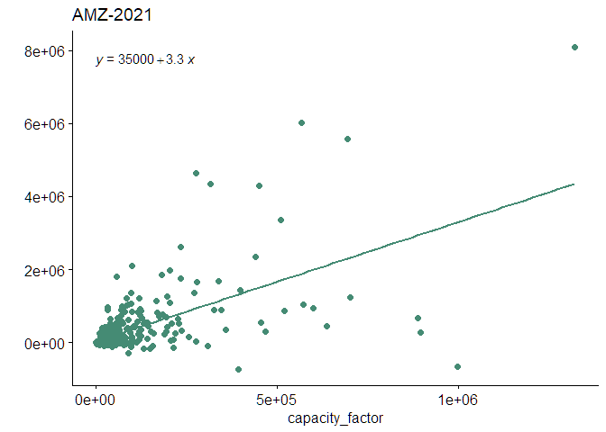<!-- -->

    #> 
    #> [[3]]

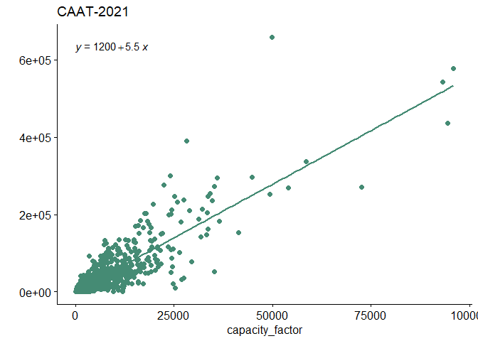<!-- -->

    #> 
    #> [[4]]

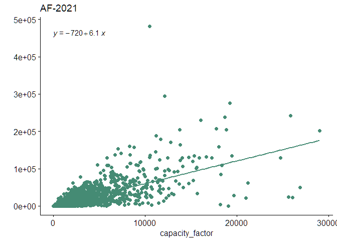<!-- -->

    #> 
    #> [[5]]

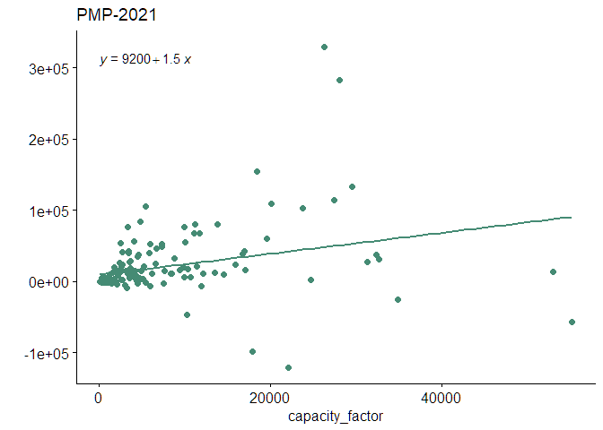<!-- -->

    #> 
    #> [[6]]

<!-- -->

``` r
map(my_biomes, ~{emission_sources_removals_ha |> 
  filter(year == 2023,
         biomes_sig == .x) |> 
  ggscatter(
    x = "capacity_factor", y = "emissions_quantity",
    add = "reg.line", color="blue",title = paste0(.x,"-2021")
  ) + # coord_cartesian(ylim = c(382.5,392))+
  # stat_cor() + #label.y = 8E6, label.x = 0
  stat_regline_equation() +
  labs(y="")})
#> [[1]]
```

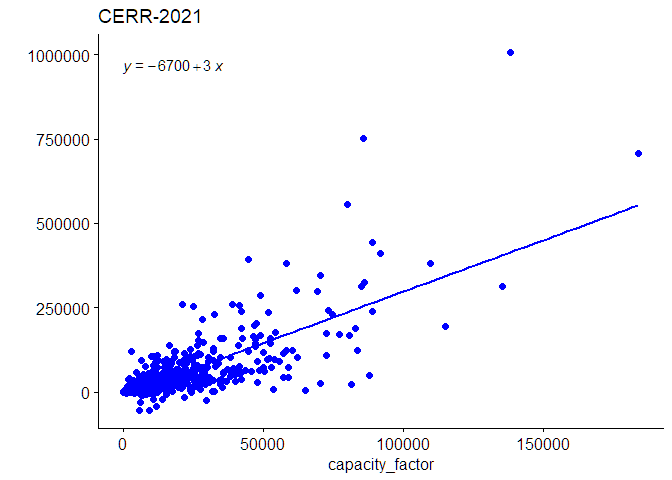<!-- -->

    #> 
    #> [[2]]

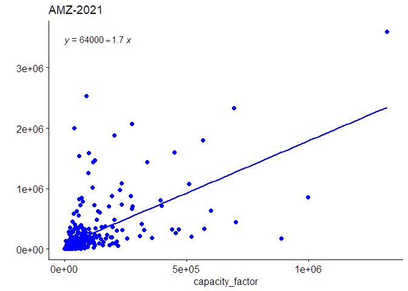<!-- -->

    #> 
    #> [[3]]

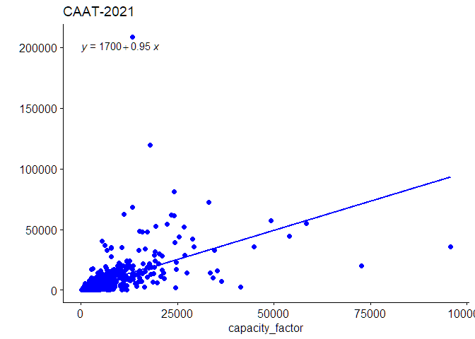<!-- -->

    #> 
    #> [[4]]

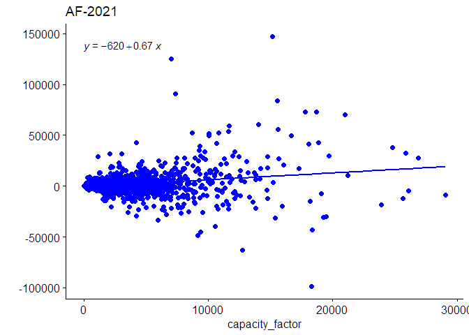<!-- -->

    #> 
    #> [[5]]

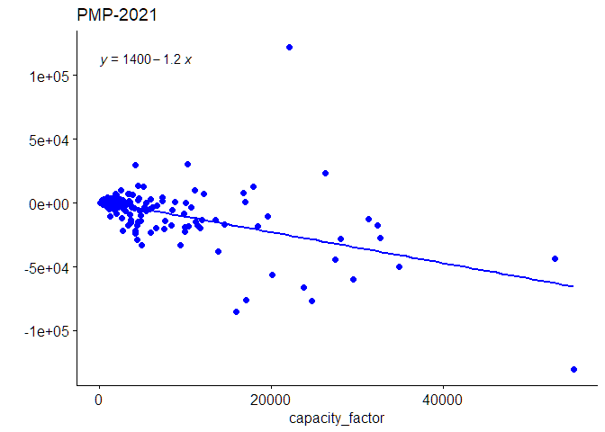<!-- -->

    #> 
    #> [[6]]

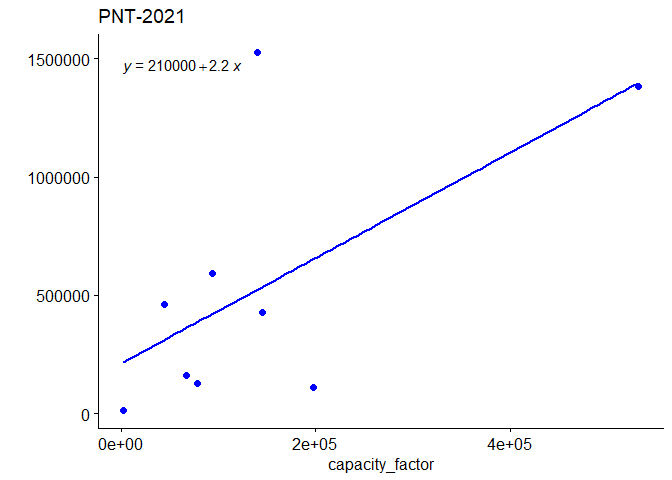<!-- -->

``` r
emission_sources_removals_ha |> 
  ungroup() |> 
  select(year, biomes_sig, emissions_quantity, capacity_factor) |> 
  group_by(biomes_sig) |> 
  summarise(
    correlacao = cor(emissions_quantity, capacity_factor, method = "pearson"),
    p_valor = cor.test(emissions_quantity, capacity_factor)$p.value,
    n = n(),
    .groups = "drop"
  )
#> # A tibble: 6 × 4
#>   biomes_sig correlacao  p_valor     n
#>   <chr>           <dbl>    <dbl> <int>
#> 1 AF              0.602 0        61848
#> 2 AMZ             0.579 0        16668
#> 3 CAAT            0.688 0        25932
#> 4 CERR            0.733 0        34848
#> 5 PMP             0.643 0         3744
#> 6 PNT             0.694 1.16e-49   336
```

## 🤖 **Modelagem Estatística e Preditiva**

Aplicação de modelos de regressão, aprendizado de máquina e análise de
variáveis importantes para a predição das remoções de CO₂.
