<!-- README.md is generated from README.Rmd. Please edit that file -->

# VARIABILIDADE ESPAÇOTEMPORAL DAS REMOÇÕES DE CO₂ POR ECOSSISTEMAS FLORESTAIS BRASILEIROS (2021–2023)

Repositório de apoio ao projeto de pesquisa de mestrado com foco na
análise espacial e temporal das remoções de dióxido de carbono (CO₂)
pela biomassa viva de ecossistemas florestais brasileiros, no período de
2021 a 2023, com base em dados da plataforma Climate
[TRACE/CTrees](https://climatetrace.org/).

## 👨‍🔬 Autores

- **Pedro Barbieri Durigan**  
  Mestrando em Agronomia - Ciência do Solo - FCAV/Unesp  
  Email: [pedro.durigan@unesp.br](mailto:pedro.durigan@unesp.b)

- **Prof. Dr. Newton La Scala Júnior**  
  Coorientador — Departamento de Ciências Exatas - FCAV/Unesp  
  Email: <la.scala@unesp.br>

- **Prof. Dr. Alan Rodrigo Panosso**  
  Coorientador — Departamento de Ciências Exatas - FCAV/Unesp  
  Email: <alan.panosso@unesp.br>

## 📁 Etapas do Projeto

Os scripts abaixo foram desenvolvidos em RMarkdown e estão disponíveis
em formato HTML:

- [`01_aquisicao_dados`](https://arpanosso.github.io//mestrado-durigan-remocoes-co2//01_aquisicao_dados.html)
  – Aquisição e download dos dados brutos.  
- [`02_tratamento_dados`](https://arpanosso.github.io//mestrado-durigan-remocoes-co2//02_tratamento_dados.html)
  – Faxina, filtragem e organização dos dados.  
- [`03_preprocessamento`](https://arpanosso.github.io//mestrado-durigan-remocoes-co2//03_preprocessamento.html)
  – Preparação dos dados para análise.

## 👉 [DOWNLOAD A BASE](https://drive.google.com/file/d/1EbGu6pI62J9fTxx2roxeRx6_WL4pZsbG/view?usp=drive_link)

## 📦 **Carregando Pacotes e a Base de dados**

Importante dropar as colunas `Other` e as emissões provenientes de áreas
urbanas, uma vez que está estão incorporadas nos `source_type` igual a
`Municipality`. Para essa análise, serão consideradas apenas as remoções
e o ano até $2024$. Nesse caso, vamos transformar os dados de
`emission_quantity` para valores positivos de remoções.

``` r
library(tidyverse)
library(ggridges)
library(geobr)
library(pracma)
source("R/graph-theme.R")
emission_sources_removals <- read_rds("data/emissions_sources.rds") |> 
  select(!starts_with("Other")) |> 
  filter(
    source_type == "Municipality",
    subsector == "removals",
    year <= 2024
    ) |> 
  mutate(
    emissions_quantity = -1*emissions_quantity,
    biomes_sig = ifelse(biomes_sig == "Other","AF",biomes_sig)
  ) 
```

## 🔍 **Análise Exploratória dos Dados**

Visualizações gráficas, estatísticas descritivas e inspeção de padrões
regionais e temporais. Inicialmente são carregados os polígonos dos país
e dos municípios, e a área dos polígomos é calculada pela função
`areaPolygon` do pacote `{geosphere}` Esse método preserva o sistema
geográfico WGS84 e considera a curvatura da Terra, ideal para áreas
irregulares e grandes. O resultado será dado em hectares.

``` r
country_br <- read_country(showProgress = FALSE)
municipality <- read_municipality(showProgress = FALSE) |> 
  group_by(name_muni) |> 
  mutate(
    area_ha = geosphere::areaPolygon(geom |> pluck(1) |> as.matrix()) / 10000
  ) |> 
  ungroup() |> 
  left_join( read_rds("data/df_nome.rds") |> 
  select(id_municipio, nome_regiao) |> 
  rename(code_muni = id_municipio) |> 
    mutate(code_muni = as.numeric(code_muni)),
  by = "code_muni")
```

Agora vamos incorporar a área ao banco de dados, criando um novo objeto.

``` r
emission_sources_removals_ha <- emission_sources_removals |> 
  left_join(
    municipality |> 
      as.tibble() |> 
      select(name_muni, area_ha) |> 
      rename(muni = name_muni),  by = "muni") |> 
  group_by(year, muni) |> 
  mutate(
    emissions_quantity_ha = (emissions_quantity)/area_ha
  )
```

Imagens dos pontos classificados por bioma

``` r
country_br |> 
    ggplot() + 
    geom_sf(fill="white", color="black",
          size=.15, show.legend = FALSE) +
    geom_point( data = emission_sources_removals_ha |> 
       filter(year == 2021),
       aes(lon,lat,colour = biomes_sig))+
    labs(x="Longitude", y="Latitude")+
    graph_theme()
```

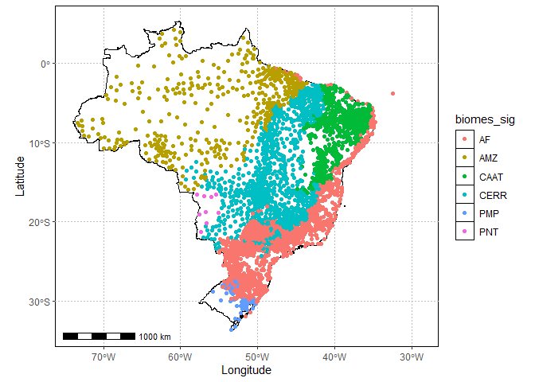<!-- -->

Criando a tabela da estatística descritiva para as remoções (M t
CO<sub>2</sub>e) e **exportanto a tabela para pasta** `output`

``` r
tab_stat <- emission_sources_removals_ha |> 
  mutate(emissions_quantity = emissions_quantity/1e6) |> 
  group_by(year) |> 
  summarise(
    Sum = sum(emissions_quantity, na.rm = TRUE),
    Mean = mean(emissions_quantity, na.rm = TRUE),
    Median = median(emissions_quantity, na.rm = TRUE),
    SD = sd(emissions_quantity, na.rm = TRUE),
    SSE = SD/sqrt(n()),
    Min = min(emissions_quantity, na.rm = TRUE),
    Max = max(emissions_quantity, na.rm = TRUE),
    Skw = agricolae::skewness(emissions_quantity),
    Krt = agricolae::kurtosis(emissions_quantity)
  )
writexl::write_xlsx(tab_stat,"output/est-removals.xlsx")
tab_stat
#> # A tibble: 4 × 10
#>    year   Sum    Mean   Median     SD      SSE    Min   Max   Skw   Krt
#>   <dbl> <dbl>   <dbl>    <dbl>  <dbl>    <dbl>  <dbl> <dbl> <dbl> <dbl>
#> 1  2021  286. 0.00384 -0.00193 0.0844 0.000309 -0.674  2.19  8.66  142.
#> 2  2022 3659. 0.0491   0.00897 0.227  0.000831 -0.743  8.08 18.2   471.
#> 3  2023 1659. 0.0223   0.00133 0.124  0.000455 -0.453  3.59 13.2   240.
#> 4  2024 1659. 0.0223   0.00133 0.124  0.000455 -0.453  3.59 13.2   240.
```

``` r
emission_sources_removals_ha  |> 
  mutate(
  #   fct_year = fct_rev(as.factor(year)),
  #   classe = ifelse(tratamento ==
  #            "UC_desm" | tratamento == "TI_desm",
  #                   "Des","Con")
  )  |> 
  ggplot(aes(y=as_factor(year))) +
  geom_density_ridges(rel_min_height = 0.03,
                      aes(x=emissions_quantity/1e6, fill=as_factor(year)),
                      alpha = .6, color = "black"
  ) +
  scale_fill_viridis_d() +
  theme_ridges() +
  coord_cartesian(xlim=c(-1e-2,1.5e-1)) +
  geom_vline(xintercept = 0, colour="black") +
  labs(x = expression(paste("Removal ( M t ",CO[2],"e)")),
       y = "Year") +
  theme(
    legend.position = ""
  )
```

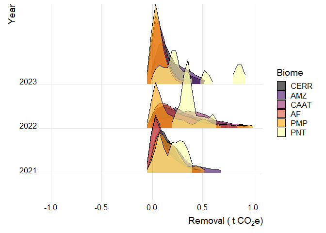<!-- -->

``` r
emission_sources_removals_ha  |> 
  mutate(
  #   fct_year = fct_rev(as.factor(year)),
  #   classe = ifelse(tratamento ==
  #            "UC_desm" | tratamento == "TI_desm",
  #                   "Des","Con")
  )  |> 
  ggplot(aes(y=as_factor(year))) +
  geom_density_ridges(rel_min_height = 0.03,
                      aes(x=emissions_quantity/1e6, fill=as_factor(biomes_sig)),
                      alpha = .6, color = "black"
  ) +
  scale_fill_viridis_d() +
  theme_ridges() +
  coord_cartesian(xlim=c(-2.5e-1,5.5e-1)) +
  geom_vline(xintercept = 0, colour="red") +
  labs(x = expression(paste("Removal ( M t ",CO[2],"e)")),
       y = "Year",fill="Biome") 
```

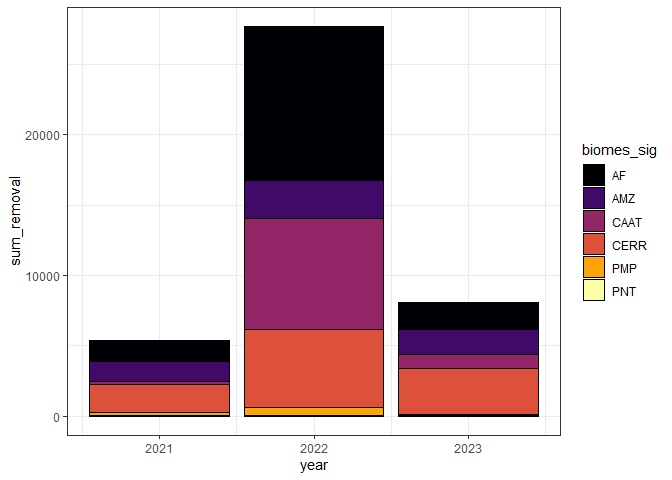<!-- -->

Gráfico das remoções

``` r
tab_stat |> 
  ggplot(aes(x=year, y=Sum/1e6)) +
  geom_col(color="black",fill="cyan4") +
  labs(y = expression(paste("Removal (M t ",CO[2],"e)"))) +
  theme_bw()
```

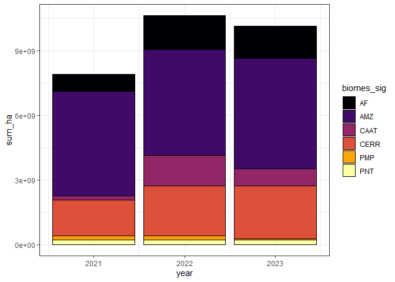<!-- -->

``` r
map(2021:2024,~{
municipality |> 
  # filter(abbrev_state == "MG") |> 
  left_join(
    emission_sources_removals_ha |> 
            filter(
              # state == "MG",
              year == .x) |> 
              group_by(muni) |> 
              summarise(
                emissions_quantity = mean(emissions_quantity)
              ) |> 
      rename(name_muni = muni),
    by = "name_muni") |> 
  mutate(emissions_quantity = ifelse(is.na(emissions_quantity),
                                        median(emissions_quantity,na.rm=TRUE),
                                        emissions_quantity)) |> 
  ggplot() +
  geom_sf(aes(fill=emissions_quantity), color="transparent",
             size=.05, show.legend = TRUE) +
  scale_fill_viridis_c() +
  labs(title = .x) +
  graph_theme()}
)
#> [[1]]
```

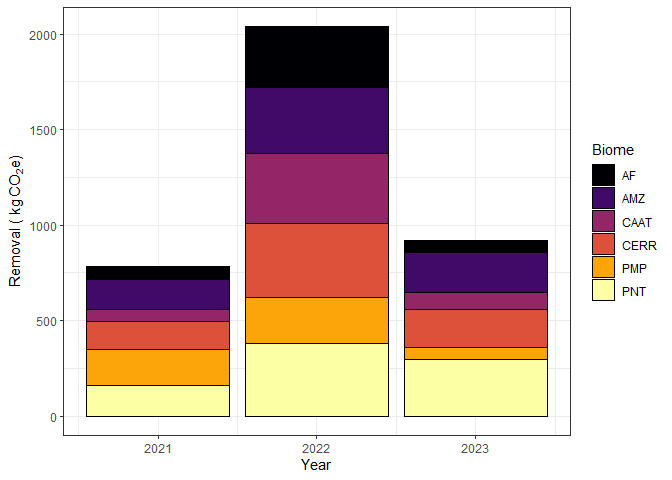<!-- -->

    #> 
    #> [[2]]

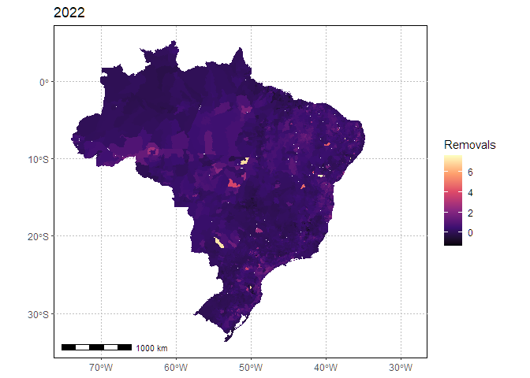<!-- -->

    #> 
    #> [[3]]

<!-- -->

    #> 
    #> [[4]]

<!-- -->

``` r
emission_sources_removals_ha |> 
  ggplot(aes(x=as_factor(year),y=emissions_quantity,
             fill = as_factor(year))) +
  geom_boxplot()+
  # geom_violin(trim = FALSE,
  #             draw_quantiles = c( 0.5),
  #             color="black") +
  theme_bw() +
  ylim(-5e4,1e5) +
  theme(
    legend.position = ""
  ) +
  scale_fill_viridis_d()
```

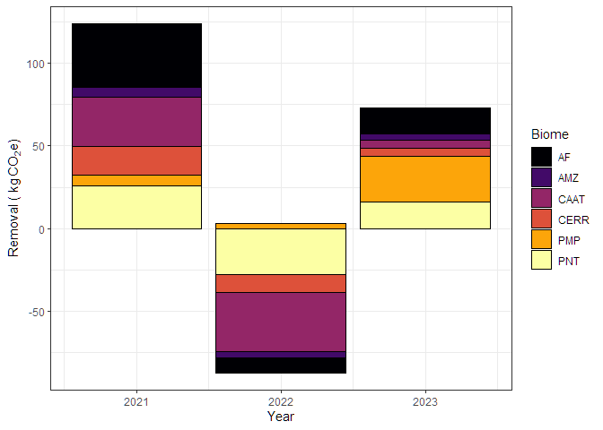<!-- -->

``` r
biomes <- emission_sources_removals_ha$biomes_sig |> unique()
map(biomes, ~{
  emission_sources_removals_ha |> 
    filter(biomes_sig == .x) |> 
    ggplot(aes(x=as_factor(year),y=emissions_quantity/1e6,
               fill = as_factor(year))) +
    geom_boxplot()+
    # geom_violin(trim = FALSE,
    #             draw_quantiles = c( 0.5),
    #             color="black") +
    theme_bw() +
    # ylim(-5e4,1e5) +
    theme(
      legend.position = ""
    ) +
    scale_fill_viridis_d()+
    labs(title = .x,
         y=expression(paste("Removal (M t ",CO[2],"e)")),
         x="Year")
})
#> [[1]]
```

<!-- -->

    #> 
    #> [[2]]

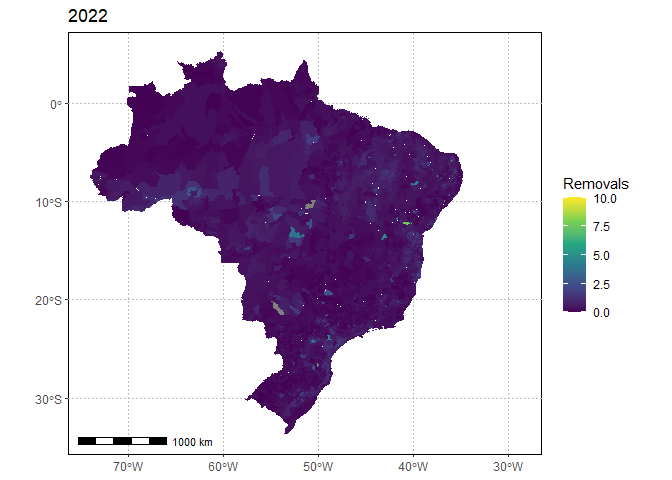<!-- -->

    #> 
    #> [[3]]

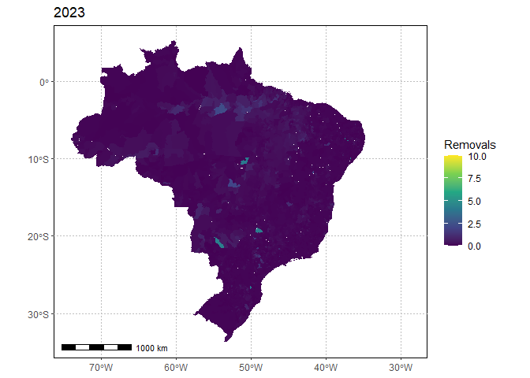<!-- -->

    #> 
    #> [[4]]

<!-- -->

    #> 
    #> [[5]]

<!-- -->

    #> 
    #> [[6]]

<!-- -->

``` r
emission_sources_removals_ha |> 
  mutate(emissions_quantity = emissions_quantity/1e6) |> 
  group_by(year,biomes_sig) |> 
  summarise(
    Sum = sum(emissions_quantity, na.rm = TRUE)) |> 
    ggplot(aes(x=year,y=Sum,fill = biomes_sig)) +
    geom_col(position = "dodge",color="black")+
    theme_bw() +
  scale_fill_viridis_d() +
    labs(fill = "Biome",
         y=expression(paste("Removal (M t ",CO[2],"e)")),
         x="Year")
```

<!-- -->

Criando a tabela da estatística descritiva para as remoções por hectare
e **exportanto a tabela para pasta** `output`

``` r
tab_stat <- emission_sources_removals_ha |> 
  group_by(year) |> 
  summarise(
    Sum = sum(emissions_quantity_ha, na.rm = TRUE),
    Mean = mean(emissions_quantity_ha, na.rm = TRUE),
    Median = median(emissions_quantity_ha, na.rm = TRUE),
    SD = sd(emissions_quantity_ha, na.rm = TRUE),
    SSE = SD/sqrt(n()),
    Min = min(emissions_quantity_ha, na.rm = TRUE),
    Max = max(emissions_quantity_ha, na.rm = TRUE),
    Skw = agricolae::skewness(emissions_quantity_ha),
    Krt = agricolae::kurtosis(emissions_quantity_ha)
  )
writexl::write_xlsx(tab_stat,"output/est-removals_ha.xlsx")
```

Gráfico das remoções por ha

``` r
tab_stat |> 
  ggplot(aes(x=year, y=Mean)) +
  geom_col(color="black",fill="salmon") +
  labs(y = expression(paste("Removal (t ",CO[2],"e per ha )"))) +
  theme_bw()
```

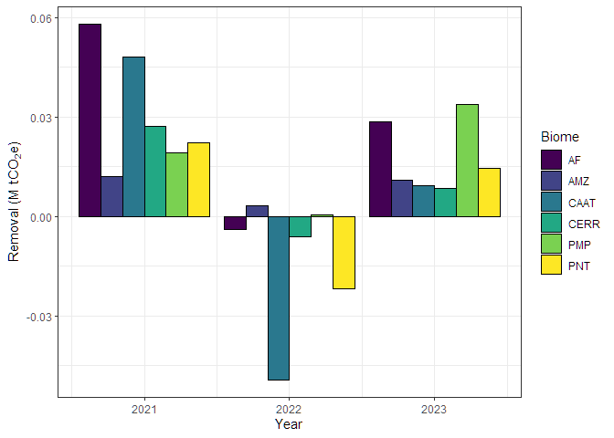<!-- -->

``` r
emission_sources_removals_ha |> 
  # mutate(emissions_quantity = emissions_quantity_ha) |> 
  group_by(year,biomes_sig) |> 
  summarise(
    Mean = mean(emissions_quantity_ha, na.rm = TRUE)) |> 
    ggplot(aes(x=year,y=Mean,fill = biomes_sig)) +
    geom_col(position = "dodge",color="black")+
    theme_bw() +
  scale_fill_viridis_d() +
    labs(fill = "Biome",
         y=expression(paste("Removal ( t ",CO[2],"e ", ha^{-1},")")),
         x="Year")
```

<!-- -->

``` r
abbrev_region <- municipality |> select(nome_regiao) |> 
  drop_na() |> pull(nome_regiao)|>  unique()
reg_year <- paste0(abbrev_region," ",rep(2021:2024,rep(5,4)))

map(reg_year,~{
  regi <- str_split(.x[1]," ", simplify = TRUE)[1,1] 
  ano <- str_split(.x[1]," ", simplify = TRUE)[1,2] 
municipality |> 
  filter(nome_regiao == regi) |> 
  left_join(
    emission_sources_removals_ha |> 
            filter(
              region == regi,
              year == ano) |> 
              group_by(muni) |> 
              summarise(
                emissions_quantity_ha = mean(emissions_quantity_ha)
              ) |> 
      rename(name_muni = muni),
    by = "name_muni") |> 
  mutate(emissions_quantity_ha = ifelse(is.na(emissions_quantity_ha),
                                        median(emissions_quantity_ha,na.rm=TRUE),
                                        emissions_quantity_ha)) |> 
  ggplot() +
  geom_sf(aes(fill=emissions_quantity_ha), color="transparent",
             size=.05, show.legend = TRUE) +
  scale_fill_viridis_c() +
  labs(title = .x) +
  graph_theme()}
)
#> [[1]]
```

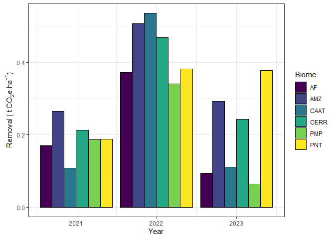<!-- -->

    #> 
    #> [[2]]

<!-- -->

    #> 
    #> [[3]]

<!-- -->

    #> 
    #> [[4]]

<!-- -->

    #> 
    #> [[5]]

<!-- -->

    #> 
    #> [[6]]

<!-- -->

    #> 
    #> [[7]]

<!-- -->

    #> 
    #> [[8]]

<!-- -->

    #> 
    #> [[9]]

<!-- -->

    #> 
    #> [[10]]

<!-- -->

    #> 
    #> [[11]]

<!-- -->

    #> 
    #> [[12]]

<!-- -->

    #> 
    #> [[13]]

<!-- -->

    #> 
    #> [[14]]

<!-- -->

    #> 
    #> [[15]]

<!-- -->

    #> 
    #> [[16]]

<!-- -->

    #> 
    #> [[17]]

<!-- -->

    #> 
    #> [[18]]

<!-- -->

    #> 
    #> [[19]]

<!-- -->

    #> 
    #> [[20]]

<!-- -->

Criando a tabela da estatística descritiva para activity e **exportanto
a tabela para pasta** `output`

``` r
tab_stat <- emission_sources_removals |> 
  group_by(biomes_sig) |> 
  summarise(
    # Sum = sum(activity, na.rm = TRUE),
    Mean = mean(activity, na.rm = TRUE),
    Median = median(activity, na.rm = TRUE),
    SD = sd(activity, na.rm = TRUE),
    SSE = SD/sqrt(n()),
    Min = min(activity, na.rm = TRUE),
    Max = max(activity, na.rm = TRUE),
    Skw = agricolae::skewness(activity),
    Krt = agricolae::kurtosis(activity)
  )
writexl::write_xlsx(tab_stat,"output/est-activity.xlsx")
```

Gráfico de activity

``` r
tab_stat |> 
  mutate(
    biomes_sig = fct_reorder(biomes_sig, Mean)
  ) |> 
  ggplot(aes(x=biomes_sig, y=Mean/1e6,fill=biomes_sig)) +
  geom_col(color="black",position = "dodge") +
  labs(y = expression(paste("Activity (M t of  ", CO[2],"in living biomass)")),
                            fill = "Biome") +
  scale_fill_viridis_d() +
  theme_bw()
```

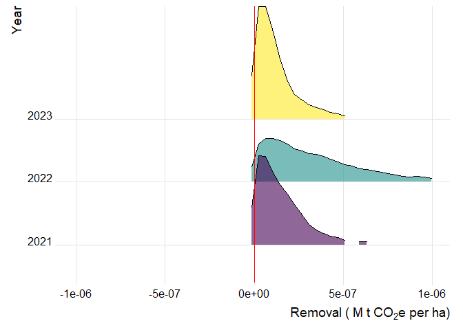<!-- -->

``` r
map(2021:2024,~{
municipality |> 
  # filter(abbrev_state == "MG") |> 
  left_join(
    emission_sources_removals_ha |> 
            filter(
              # state == "MG",
              year == .x) |> 
              group_by(muni) |> 
              summarise(
                activity = mean(activity)
              ) |> 
      rename(name_muni = muni),
    by = "name_muni") |> 
  mutate(activity = ifelse(is.na(activity),
                                        median(activity,na.rm=TRUE),
                                        activity)) |> 
  ggplot() +
  geom_sf(aes(fill=activity), color="transparent",
             size=.05, show.legend = TRUE) +
  scale_fill_viridis_c() +
  labs(title = .x) +
  graph_theme()}
)
#> [[1]]
```

<!-- -->

    #> 
    #> [[2]]

<!-- -->

    #> 
    #> [[3]]

<!-- -->

    #> 
    #> [[4]]

<!-- -->

Criando a tabela da estatística descritiva para capacity e **exportanto
a tabela para pasta** `output`

``` r
tab_stat <- emission_sources_removals |> 
  group_by(biomes_sig) |> 
  summarise(
    # Sum = sum(capacity, na.rm = TRUE),
    Mean = mean(capacity, na.rm = TRUE),
    Median = median(capacity, na.rm = TRUE),
    SD = sd(capacity, na.rm = TRUE),
    SSE = SD/sqrt(n()),
    Min = min(capacity, na.rm = TRUE),
    Max = max(capacity, na.rm = TRUE),
    Skw = agricolae::skewness(capacity),
    Krt = agricolae::kurtosis(capacity)
  )
writexl::write_xlsx(tab_stat,"output/est-capacity.xlsx")
```

Gráfico de capacity

``` r
tab_stat |> 
  mutate(
    biomes_sig = fct_reorder(biomes_sig, Mean)
  ) |> 
  ggplot(aes(x=biomes_sig, y=Mean/1e6,fill=biomes_sig)) +
  geom_col(color="black",position = "dodge") +
  labs(y = expression(paste("Capacity (M t of  ", CO[2]," in living biomass per ha)")),
                            fill = "Biome") +
  scale_fill_viridis_d() +
  theme_bw()
```

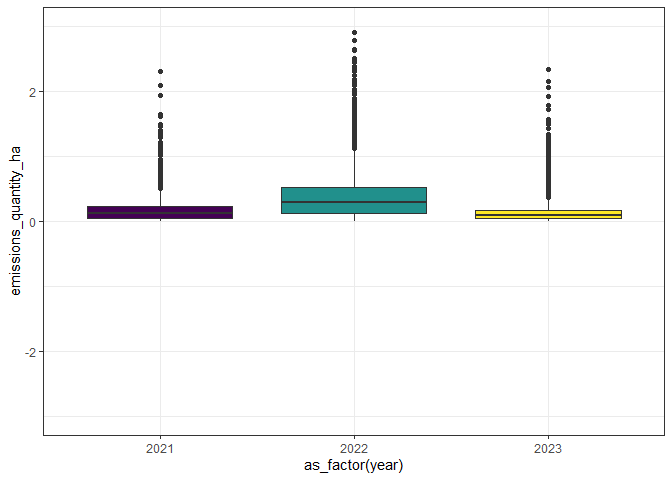<!-- -->

``` r
map(2021:2024,~{
municipality |> 
  # filter(abbrev_state == "MG") |> 
  left_join(
    emission_sources_removals_ha |> 
            filter(
              # state == "MG",
              year == .x) |> 
              group_by(muni) |> 
              summarise(
                capacity = mean(capacity)
              ) |> 
      rename(name_muni = muni),
    by = "name_muni") |> 
  mutate(capacity = ifelse(is.na(capacity),
                                        median(capacity,na.rm=TRUE),
                                        capacity)) |> 
  ggplot() +
  geom_sf(aes(fill=capacity), color="transparent",
             size=.05, show.legend = TRUE) +
  scale_fill_viridis_c(option = "magma") +
  labs(title = .x) +
  graph_theme()}
)
#> [[1]]
```

<!-- -->

    #> 
    #> [[2]]

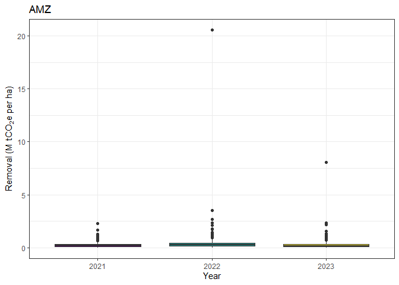<!-- -->

    #> 
    #> [[3]]

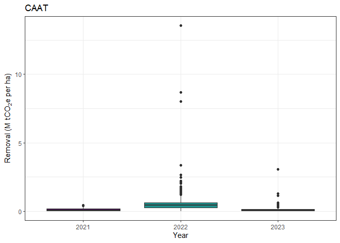<!-- -->

    #> 
    #> [[4]]

<!-- -->

## 🧪 **Estatística Multivariada**

Técnicas como Análise de Componentes Principais (PCA), agrupamentos
(clustering) e correlações espaciais.

## 🤖 **Modelagem Estatística e Preditiva**

Aplicação de modelos de regressão, aprendizado de máquina e análise de
variáveis importantes para a predição das remoções de CO₂.
