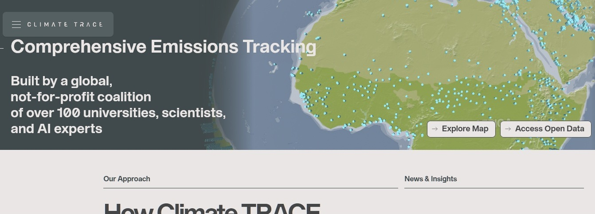
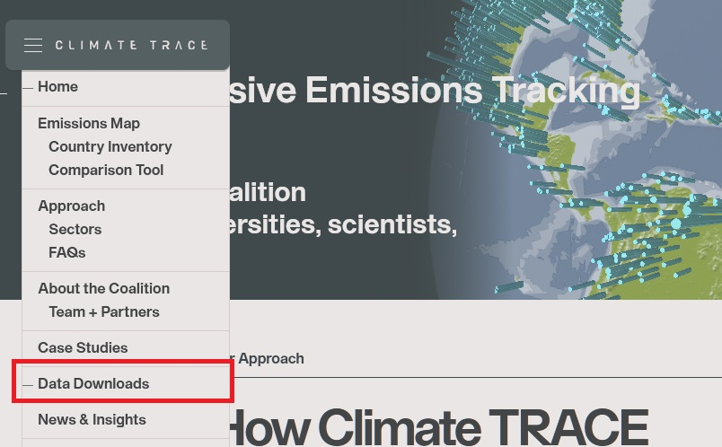
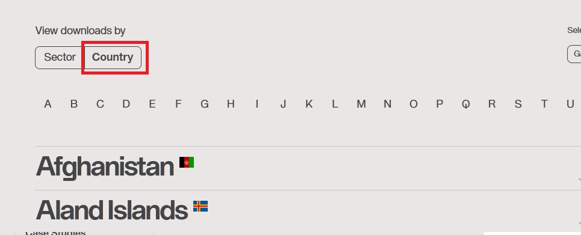
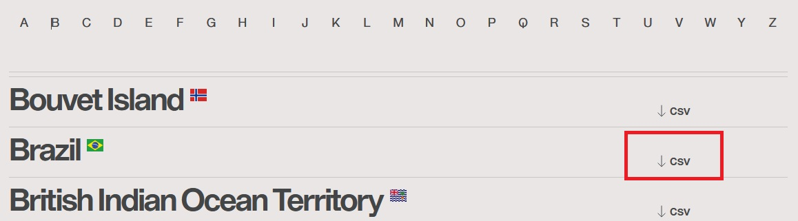

```{r setup, include=FALSE}
knitr::opts_chunk$set(echo = TRUE,
                      warning = FALSE,
                      message = FALSE,
                      error = FALSE,  comment = "#>",
                      cache = TRUE,
                      fig.width = 10,
                      fig.height = 6) 
```

## 📥 Introdução

Este tutorial mostra como acessar manualmente os dados do Climate TRACE/CTrees
pela internet, realizando o download direto via navegador.

## 🌐 Acessando a Plataforma

### 1. Acesse o site oficial: <https://climatetrace.org>



### 2. No menu lateral, superior esquerdo, clique em **"Data Downloads"**.



### 3. Navegue até **"View downloads by"** e escolha a opção **"Country"**.



### 4. Encontre o país de interesse

Role a lista até encontrar **Brazil** (ou outro país de interesse) e clique no
link **CSV** correspondente.\
Isso iniciará o download de um arquivo compactado no formato `.zip`.



O arquivo baixado conterá os dados de `emissões/remoções` por setor subsetor e
tipo de gás para o país selecionado.

### 📥 Disponibilização dos Dados

Para garantir a reprodutibilidade deste material, estamos disponibilizando os
dados baixados da plataforma Climate TRACE para o Brasil, no dia 28/04/2025,
correspondentes à versão V4-2-0 do banco de dados.

## 👉 [DOWNLOAD - BRA.ZIP](https://drive.google.com/file/d/1knhsInIRTOXH2OlTc_B2_dlID7fEAtDc/view?usp=sharing)

Esses arquivos serão utilizados como referência para todas as análises descritas
ao longo deste documento.

### 5. Descompactar e organizar o arquivo

Após o download:

-   Descompacte o arquivo `.zip`;
-   Mova a pasta com os arquivos descompactados para a pasta `data-raw/` do seu
    projeto em R.

> 🧼 Com o arquivo no lugar certo, prossiga para a etapa de **tratamento e
> faxina dos dados** - [`02_tratamento_dados`](scripts/02_tratamento_dados.html)
> – Faxina, filtragem e organização dos dados.

## 💡 Acessando por API

<div>

```         
                             █████╗ ██████╗ ██╗
                            ██╔══██╗██╔══██╗██║
                            ███████║██████╔╝██║
                            ██╔══██║██╔═══╝ ██║
                            ██║  ██║██║     ██║
                            ╚═╝  ╚═╝╚═╝     ╚═╝
                            
                             ██████╗████████╗
                            ██╔════╝╚══██╔══╝
                            ██║        ██║   
                            ██║        ██║   
                            ╚██████╗   ██║   
                             ╚═════╝   ╚═╝ 
```

</div>

A API Climate TRACE oferece acesso a dados globais de emissões de gases de
efeito estufa. Este guia explora todos os endpoints e recursos até agora disponíveis.

### INFORMAÇÕES DE CONFIGURAÇÃO

Informação e documentação podem ser acessadas em [API-ClimateTRACE](https://api.climatetrace.org)

### Preparando o Ambiente

Todas as funções aqui utilizadas estão documentadas em [`climatetrace_api.R`]()

```{r source}
source("../R/climatetrace_api.R")
```


### Explorando Recursos Disponíveis

#### 1. Metadata e Definições

INICIANDO EXTRAÇÃO DE METADADOS... PROCESSANDO DEFINIÇÕES...

### 1.1 Países Disponíveis

```{r countries}
# Obtendo lista de países
paises <- get_countries()

# Tabela com os primeiros 10 países
knitr::kable(head(paises, 10), caption = "Amostra de Países") |> 
  kableExtra::kable_styling(bootstrap_options = c("striped", "hover"), font_size = 12)

# Total de países
cat("Total de países disponíveis:", nrow(paises))
```

### 1.2 Continentes Disponíveis

```{r continents}
# Obtendo lista de continentes
tryCatch({
  continentes <- get_continents()
  
  if (is.list(continentes) || is.vector(continentes)) {
    cat("Continentes disponíveis:\n")
    print(continentes)
  } else if (is.data.frame(continentes)) {
    knitr::kable(continentes, caption = "Continentes") |> 
      kableExtra::kable_styling(bootstrap_options = c("striped", "hover"))
  }
}, error = function(e) {
  cat("Obtendo continentes via documentação:\n")
  continentes_doc <- c("Asia", "South America", "North America", 
                       "Oceania", "Antarctica", "Africa", "Europe")
  print(continentes_doc)
})
```

### 1.3 Setores de Emissão

```{r sectors}
# Obtendo setores
setores <- get_sectors()

# Verificando a estrutura para diagnóstico
cat("Estrutura dos dados de setores:\n")
str(setores, max.level = 1)

# Lidando com diferentes formatos de resposta possíveis
if (is.list(setores)) {
  # Se for uma lista, extraímos os nomes
  setores_list <- names(setores)
  
  # Criando dataframe com setores (limitado a 20 para evitar erros de tamanho)
  setores_df <- data.frame(Setor = head(setores_list, 20))
  
  # Mostrando tabela de setores
  knitr::kable(setores_df, caption = "Setores Disponíveis na API (top 20)") |> 
    kableExtra::kable_styling(bootstrap_options = c("striped", "hover"), font_size = 12)
  
  cat("\nTotal de setores disponíveis:", length(setores_list))
  
  # Se houver mais de 20 setores, mostramos o restante como texto
  if (length(setores_list) > 20) {
    cat("\n\nSetores adicionais:\n")
    cat(paste(setores_list[21:min(40, length(setores_list))], collapse = ", "))
    if (length(setores_list) > 40) {
      cat(", ...")
    }
  }
} else {
  # Caso a estrutura seja diferente, mostramos apenas os dados brutos
  cat("Dados de setores em formato não-estruturado:\n")
  print(head(setores))
}
```

### 1.4 Subsetores de Emissão

```{r subsectors}
# Obtendo subsetores
subsetores <- get_subsectors()

# Verificando a estrutura para diagnóstico
cat("Estrutura dos dados de subsetores:\n")
str(subsetores, max.level = 1)

# Lidando com diferentes formatos de resposta possíveis
if (is.list(subsetores)) {
  # Se for uma lista, extraímos os nomes
  subsetores_list <- names(subsetores)
  
  # Criando dataframe com subsetores (limitado a 20 para evitar erros de tamanho)
  subsetores_df <- data.frame(Subsetor = head(subsetores_list, 20))
  
  # Mostrando tabela de subsetores
  knitr::kable(subsetores_df, caption = "Subsetores Disponíveis na API (top 20)") |> 
    kableExtra::kable_styling(bootstrap_options = c("striped", "hover"), font_size = 12)
  
  cat("\nTotal de subsetores disponíveis:", length(subsetores_list))
  
  # Se houver mais de 20 subsetores, mostramos o restante como texto
  if (length(subsetores_list) > 20) {
    cat("\n\nSubsetores adicionais (mostrando até 40):\n")
    cat(paste(subsetores_list[21:min(40, length(subsetores_list))], collapse = ", "))
    if (length(subsetores_list) > 40) {
      cat(", ...")
    }
  }
} else {
  # Caso a estrutura seja diferente, mostramos apenas os dados brutos
  cat("Dados de subsetores em formato não-estruturado:\n")
  print(head(subsetores))
}
```

### 1.5 Tipos de Gases

```{r gases}
# Obtendo tipos de gases
tryCatch({
  gases <- get_gases()
  
  if (is.list(gases) || is.vector(gases)) {
    cat("Gases disponíveis:\n")
    print(gases)
  } else if (is.data.frame(gases)) {
    knitr::kable(gases, caption = "Gases") |> 
      kableExtra::kable_styling(bootstrap_options = c("striped", "hover"))
  }
}, error = function(e) {
  cat("Obtendo gases via documentação:\n")
  gases_doc <- c("n2o", "co2e", "co2", "ch4", "co2e_20yr", "co2e_100yr")
  print(gases_doc)
})
```

### 1.6 Grupos de Países

```{r groups}
# Obtendo grupos de países
tryCatch({
  grupos <- get_groups()
  
  if (is.list(grupos) || is.vector(grupos)) {
    cat("Grupos disponíveis:\n")
    print(head(grupos, 10))
    cat("Total de grupos:", length(grupos))
  } else if (is.data.frame(grupos)) {
    knitr::kable(head(grupos, 10), caption = "Amostra de Grupos") |> 
      kableExtra::kable_styling(bootstrap_options = c("striped", "hover"))
    cat("Total de grupos:", nrow(grupos))
  }
}, error = function(e) {
  cat("Não foi possível obter informações sobre grupos.\n")
  cat("Use o endpoint /v6/definitions/groups para explorar os grupos disponíveis.")
})
```

::: section-header
┌─────────────────────────────────────────────────────────────────────┐ │ FONTES
DE EMISSÃO │
└─────────────────────────────────────────────────────────────────────┘
:::

## 2. Fontes de Emissão (Assets)

::: {.ascii-art style="font-size: 12px;"}
INICIANDO ANÁLISE DE FONTES DE EMISSÃO... COLETANDO DADOS...
:::

A API Climate TRACE permite obter dados detalhados sobre fontes específicas de
emissão:

### 2.1 Buscar Fontes de Emissão (Assets)

```{r assets_search}
# Buscando fontes de emissão no Brasil para o setor de uso de terra
fontes_brasil <- search_assets(
  countries = "BRA",
  sectors = "forestry-and-land-use",
  year = 2022,
  limit = 5
)

# Explorando a estrutura da resposta
cat("Estrutura da resposta para assets:\n")
str(fontes_brasil, max.level = 1)

# Extraindo informações básicas das fontes (se disponíveis)
if (!is.null(fontes_brasil) && "features" %in% names(fontes_brasil)) {
  cat("\nExemplo de fontes encontradas:\n")
  
  # Criando dataframe com informações básicas
  fontes_info <- lapply(fontes_brasil$features, function(feature) {
    if (is.null(feature$properties)) {
      return(data.frame(id = feature$id, type = NA, name = NA))
    } else {
      return(data.frame(
        id = feature$id,
        type = ifelse(is.null(feature$properties$type), NA, feature$properties$type),
        name = ifelse(is.null(feature$properties$name), NA, feature$properties$name)
      ))
    }
  })
  
  fontes_df <- do.call(rbind, fontes_info)
  
  # Mostrando tabela com as fontes
  knitr::kable(fontes_df, caption = "Fontes de Emissão - Brasil (Setor Florestal)") |> 
    kableExtra::kable_styling(bootstrap_options = c("striped", "hover"), font_size = 12)
}
```

### 2.3 Emissões por Fonte

```{r asset_emissions}
# Obtendo emissões agregadas por fonte
emissoes_fontes <- get_asset_emissions(
  countries = "BRA",
  sectors = "forestry-and-land-use",
  years = 2022,
  gas = "co2e"
)

# Explorando a estrutura
cat("Estrutura da resposta para emissões por fonte:\n")
str(emissoes_fontes, max.level = 1)

# Mostrando amostra dos dados em formato de tabela
if (is.data.frame(emissoes_fontes) && nrow(emissoes_fontes) > 0) {
  knitr::kable(head(emissoes_fontes, 10), caption = "Emissões por Fonte - Brasil (2022)") |> 
    kableExtra::kable_styling(bootstrap_options = c("striped", "hover"), font_size = 12)
  
  cat("Total de registros:", nrow(emissoes_fontes))
}
```

::: section-header
┌─────────────────────────────────────────────────────────────────────┐ │
ANÁLISE POR PAÍSES │
└─────────────────────────────────────────────────────────────────────┘
:::

## 3. Emissões por País

::: {.ascii-art style="font-size: 12px;"}
INICIANDO ANÁLISE POR PAÍSES... COMPARANDO DADOS ENTRE REGIÕES...
:::

### 3.1 Emissões Agregadas por País

```{r country_emissions}
# Obtendo emissões agregadas para um grupo de países
paises_amostra <- c("BRA", "USA", "CHN", "IND", "RUS")
emissoes_paises <- get_country_emissions(
  countries = paises_amostra,
  sector = "forestry-and-land-use",
  since = 2020,
  to = 2022
)

# Estrutura da resposta
cat("Estrutura da resposta para emissões por país:\n")
str(emissoes_paises, max.level = 1)

# Criando tabela com dados principais
if (is.data.frame(emissoes_paises) && nrow(emissoes_paises) > 0) {
  # Extraindo dados principais
  emissoes_resumo <- data.frame(
    País = emissoes_paises$country,
    Continente = emissoes_paises$continent,
    Rank = emissoes_paises$rank
  )
  
  # Adicionando emissões de CO2 (se disponível)
  if ("emissions" %in% names(emissoes_paises)) {
    if (is.data.frame(emissoes_paises$emissions) && "co2" %in% names(emissoes_paises$emissions)) {
      emissoes_resumo$CO2_Mt <- emissoes_paises$emissions$co2 / 1e6  # Convertendo para Mt
    }
    
    if (is.data.frame(emissoes_paises$emissions) && "co2e_100yr" %in% names(emissoes_paises$emissions)) {
      emissoes_resumo$CO2e_100yr_Mt <- emissoes_paises$emissions$co2e_100yr / 1e6
    }
  }
  
  # Adicionando nomes dos países
  paises_info <- get_countries()
  emissoes_resumo$Nome_País <- paises_info$name[match(emissoes_resumo$País, paises_info$alpha3)]
  
  # Reordenando colunas
  if ("Nome_País" %in% names(emissoes_resumo)) {
    emissoes_resumo <- emissoes_resumo |> 
      select(Nome_País, País, Continente, everything())
  }
  
  # Mostrando tabela
  knitr::kable(emissoes_resumo, caption = "Emissões por País (2020-2022)") |> 
    kableExtra::kable_styling(bootstrap_options = c("striped", "hover"), font_size = 12)
}
```

::: section-header
┌─────────────────────────────────────────────────────────────────────┐ │
EXEMPLOS PRÁTICOS DE USO │
└─────────────────────────────────────────────────────────────────────┘
:::

# Exemplos Práticos de Uso da API

::: {.ascii-art style="font-size: 12px;"}
GERANDO EXEMPLOS DE CÓDIGO PARA CASOS DE USO COMUNS...
:::

## Exemplo 1: Emissões de Desmatamento por País

```{r desmatamento}
# Buscando emissões do subsetor de desmatamento para os principais países
paises_tropicais <- c("BRA", "IDN", "COD", "MYS", "PER")
desmatamento <- get_country_emissions(
  countries = paises_tropicais,
  sector = "forestry-and-land-use",
  subsectors = "forest-land-clearing",
  since = 2020,
  to = 2022
)

# Criando tabela com os resultados
if (is.data.frame(desmatamento) && nrow(desmatamento) > 0) {
  # Extraindo dados principais
  desmat_resumo <- data.frame(
    País = desmatamento$country,
    CO2_Mt = ifelse("emissions" %in% names(desmatamento) && 
                    "co2" %in% names(desmatamento$emissions),
                   desmatamento$emissions$co2 / 1e6, NA)
  )
  
  # Adicionando nomes dos países
  paises_info <- get_countries()
  desmat_resumo$Nome_País <- paises_info$name[match(desmat_resumo$País, paises_info$alpha3)]
  
  # Reordenando e ordenando por emissão
  desmat_resumo <- desmat_resumo |> 
    select(Nome_País, País, CO2_Mt) |> 
    arrange(desc(CO2_Mt))
  
  # Mostrando tabela
  knitr::kable(desmat_resumo, caption = "Emissões por Desmatamento (2020-2022)") |> 
    kableExtra::kable_styling(bootstrap_options = c("striped", "hover"), font_size = 12)
}
```

## Exemplo 2: Remoções de Carbono Florestal

```{r remocoes}
# Buscando dados de remoções de carbono
remocoes <- get_country_emissions(
  countries = c("BRA", "USA", "CHN", "RUS", "CAN"),
  sector = "forestry-and-land-use",
  subsectors = "removals",
  since = 2020,
  to = 2022
)

# Criando tabela com os resultados
if (is.data.frame(remocoes) && nrow(remocoes) > 0) {
  # Extraindo dados principais
  remoc_resumo <- data.frame(
    País = remocoes$country,
    Remoção_CO2_Mt = ifelse("emissions" %in% names(remocoes) && 
                           "co2" %in% names(remocoes$emissions),
                         -remocoes$emissions$co2 / 1e6, NA)  # Negativo indica remoção
  )
  
  # Adicionando nomes dos países
  paises_info <- get_countries()
  remoc_resumo$Nome_País <- paises_info$name[match(remoc_resumo$País, paises_info$alpha3)]
  
  # Reordenando e ordenando por remoção
  remoc_resumo <- remoc_resumo |> 
    select(Nome_País, País, Remoção_CO2_Mt) |> 
    arrange(desc(Remoção_CO2_Mt))
  
  # Mostrando tabela
  knitr::kable(remoc_resumo, caption = "Remoções de Carbono (2020-2022)") |> 
    kableExtra::kable_styling(bootstrap_options = c("striped", "hover"), font_size = 12)
}
```

::: section-header
┌─────────────────────────────────────────────────────────────────────┐ │
DOCUMENTAÇÃO DE REFERÊNCIA │
└─────────────────────────────────────────────────────────────────────┘
:::

# Parâmetros Disponíveis por Endpoint

::: {.ascii-art style="font-size: 12px;"}
DOCUMENTANDO PARÂMETROS DE API... CRIANDO REFERÊNCIA TÉCNICA...
:::

## 1. Endpoint: /v6/assets (Fontes de Emissão)

```{r assets_params, echo=FALSE}
# Criando tabela de parâmetros para o endpoint assets
assets_params <- data.frame(
  Parâmetro = c("countries", "sectors", "subsectors", "year", "limit", "offset", "continents", "adminId"),
  Tipo = c("array[string]", "array[string]", "string", "integer", "integer", "integer", "array[string]", "integer"),
  Descrição = c("Lista de códigos de países (3 letras)", 
               "Lista de setores",
               "Lista de subsetores",
               "Ano (2020-2050)",
               "Máximo de itens retornados (0-1000)",
               "Deslocamento para paginação (0-100)",
               "Lista de continentes",
               "ID de área administrativa")
)

knitr::kable(assets_params, caption = "Parâmetros para /v6/assets") |> 
  kableExtra::kable_styling(bootstrap_options = c("striped", "hover"), font_size = 12)
```

## 2. Endpoint: /v6/assets/emissions (Emissões por Fonte)

```{r assets_emissions_params, echo=FALSE}
# Criando tabela de parâmetros para o endpoint de emissões por fonte
emissions_params <- data.frame(
  Parâmetro = c("adminId", "years", "subsectors", "sectors", "continents", "groups", "countries", "gas"),
  Tipo = c("integer", "array[integer]", "string", "array[string]", "array[string]", "array[string]", "array[string]", "string"),
  Descrição = c("ID de área administrativa", 
               "Lista de anos", 
               "Lista de subsetores",
               "Lista de setores",
               "Lista de continentes",
               "Lista de grupos",
               "Lista de códigos de países",
               "Tipo de gás (n2o, co2e, co2, ch4, co2e_20yr, co2e_100yr)")
)

knitr::kable(emissions_params, caption = "Parâmetros para /v6/assets/emissions") |> 
  kableExtra::kable_styling(bootstrap_options = c("striped", "hover"), font_size = 12)
```

## 3. Endpoint: /v6/country/emissions (Emissões por País)

```{r country_emissions_params, echo=FALSE}
# Criando tabela de parâmetros para o endpoint de emissões por país
country_params <- data.frame(
  Parâmetro = c("since", "to", "sector", "subsectors", "continents", "groups", "countries"),
  Tipo = c("integer", "integer", "array[string]", "string", "array[string]", "array[string]", "array[string]"),
  Descrição = c("Ano inicial (2000-2050)", 
               "Ano final (2000-2050)", 
               "Lista de setores",
               "Lista de subsetores",
               "Lista de continentes",
               "Lista de grupos",
               "Lista de códigos de países")
)

knitr::kable(country_params, caption = "Parâmetros para /v6/country/emissions") |> 
  kableExtra::kable_styling(bootstrap_options = c("striped", "hover"), font_size = 12)
```

DOCUMENTAÇÃO COMPLETA... GUIA DE REFERÊNCIA GERADO...

## NOTAS DE ENCERRAMENTO

### Salvando Dados Localmente

```{r save_data, eval=FALSE}
# Obtendo dados
brasil_florestal <- get_country_emissions(
  countries = "BRA", 
  sector = "forestry-and-land-use",
  since = 2015,
  to = 2022
)

# Criando pasta se não existir
if (!dir.exists("data")) dir.create("data")

# Salvando como RDS (formato nativo do R)
saveRDS(brasil_florestal, "data/brasil_florestal_2015_2022.rds")

# Salvando como CSV (para uso em outros softwares)
if (is.data.frame(brasil_florestal)) {
  write.csv(brasil_florestal, "data/brasil_florestal_2015_2022.csv", row.names = FALSE)
}
```

DOCUMENTAÇÃO OFICIAL: <https://api.climatetrace.org>
