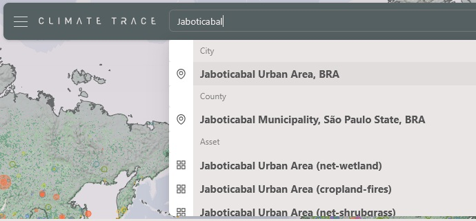
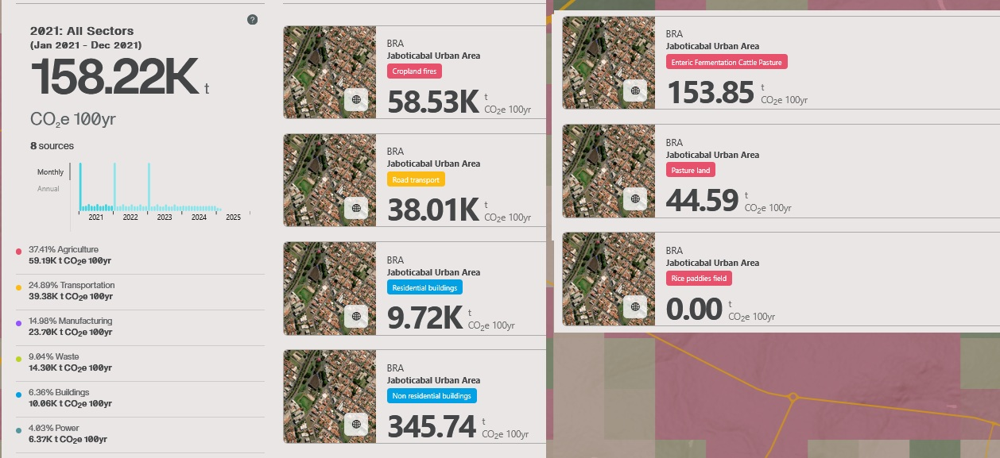

```{r setup, include=FALSE}
knitr::opts_chunk$set(echo = TRUE,
                      message = FALSE, 
                      error = FALSE, 
                      warning = FALSE)
```

## 🛠️ Pré-processamento

Nesta etapa, vamos realizar um pré-processamento mais refinado dos dados, que inclui: visualização espacial dos pontos para identificar padrões geográficos e possíveis inconsistências de localização; Filtragem de Linhas e Variáveis e Seleção de observações e atributos relevantes para as próximas etapas da análise; Detecção de Inconsistências: Identificação de valores extremos ou incoerentes que podem comprometer a qualidade das análises futuras.

### 📄 Carregando dados de emissões

```{r}
emissions_sources <- readr::read_rds("../data/emissions_sources.rds")
```

### 🔎 Validação dos dados (ano = 2021)

Após o tratamento, os dados foram analisados e comparados com as informações originais do site [Climate TRACE](https://climatetrace.org/), com o objetivo de verificar a consistência e a qualidade do processamento.

Ao buscar o município de **"Jaboticabal"** na plataforma, são apresentadas várias categorias de dados, referentes às emissões de gases de efeito estufa em diferentes níveis geográficos e fontes.



As principais categorias encontradas são:

-   **City** - Jaboticabal Urban Area, BR: Refere-se à área urbana de Jaboticabal e apresenta dados de emissões provenientes das atividades dentro dessa zona, como transporte, indústria e outros fatores urbanos.



```{r}
emissions_sources |>
    dplyr::filter(
    stringr::str_detect(source_name, "Jaboticabal") | muni == "Jaboticabal",
    year == 2024,
    !subsector %in% c("forest-land-clearing",
                     "forest-land-degradation",
                     "forest-land-fires",
                     "removals",
                     "shrubgrass-fires",
                     "wetland-fires"),
    # sector != "forestry-and-land-use"
    ) |>
 dplyr::group_by(sector) |>
  dplyr::summarise(
    emissions_quantity_sum = sum(emissions_quantity, na.rm = TRUE)
  ) |>
  dplyr::mutate(
   emissions_quantity_cumsum = cumsum(emissions_quantity_sum)
  )
```

-   **Country** - Jaboticabal Municipality, São Paulo State, BRA: Relacionado ao município de Jaboticabal como um todo, esta categoria inclui dados sobre as emissões em áreas rurais e urbanas, englobando fontes como agricultura e uso do solo.

-   **Asset**: Refere-se a fontes específicas de emissões dentro da cidade ou município, como fábricas, usinas de energia ou instalações industriais. Cada "asset" tem dados específicos sobre suas emissões, permitindo uma análise mais detalhada.

### ⏳ Filtrando os dados para `forestry-and-land-use` e selecionando variáveis para a análise.

```{r}
emissions_sources_forestry <- emissions_sources |> 
   dplyr::filter(
     gas == "co2e_100yr",
     sector == "forestry-and-land-use"
   ) |> 
   dplyr::mutate(
     source_name = stringr::str_to_title(source_name)
   ) |> 
  dplyr::select(
    -c(source_id,iso3_country,created_date,modified_date,lat_lon,directory,native_source_id,
       start_time,end_time,source_type,reporting_entity,sector_id,reporting_entity,geometry_ref)) |> 
  dplyr::relocate(year,month,lon,lat,source_name,muni,state,region)
```

### 📈📊

Usa a função `vis_miss()` do pacote `{visdat}` para visualizar graficamente os dados faltantes (NAs).

Ele gera um gráfico de calor onde:

```         
As células preenchidas mostram dados presentes.

As células em branco ou coloridas indicam dados ausentes.
```

```{r}
emissions_sources_forestry |> 
  dplyr::sample_n(3e4) |> 
  visdat::vis_miss()
```

### 🗺️ Plotando espacialmente os ponto

Nesta etapa, vamos representar os dados no espaço geográfico, gerando mapas que permitem visualizar a distribuição dos pontos de interesse. A plotagem espacial é fundamental para identificar padrões, áreas de maior concentração e possíveis anomalias nos dados.

Vamos carregar os polígonos de interesse

```{r}
country_br <- geobr::read_country(showProgress = FALSE)
conservation <- geobr::read_conservation_units(showProgress = FALSE)
indigenous <- geobr::read_indigenous_land(showProgress = FALSE)
```

Criando o mapa com sobreposição

Terras Indígenas reconhecidas

```{r}
indigenous    |> 
  ggplot2::ggplot() +
  ggplot2::geom_sf(fill="white", color="black",
          size=.15, show.legend = FALSE) +
  ggplot2::geom_point(
    data = emissions_sources_forestry  |> 
      dplyr::filter(
        year == 2021,
        indigenous != "Other"),
     ggplot2::aes(lon,lat)) +
  ggplot2::theme_bw()
```

Áreas de conservação

```{r}
conservation    |> 
  ggplot2::ggplot() +
  ggplot2::geom_sf(fill="white", color="black",
          size=.15, show.legend = FALSE) +
  ggplot2::geom_point(
    data = emissions_sources_forestry  |> 
      dplyr::filter(
        year == 2021,
        conservation != "Other"),
     ggplot2::aes(lon,lat)) +
  ggplot2::theme_bw()
```

### 📊📦 Visualização dos Dados

Nesta seção, serão construídos histogramas e boxplots para avaliar a distribuição das variáveis numéricas disponíveis no conjunto de dados.

-   Histogramas ajudam a identificar o comportamento geral dos dados, como simetria, caudas longas ou concentrações anormais de valores.

-   Boxplots facilitam a visualização de outliers, assimetria e amplitude interquartil (IQR), sendo ferramentas rápidas para checagem da qualidade e integridade dos dados.

A combinação dos dois gráficos para cada variável permite uma análise exploratória robusta e auxilia na identificação de possíveis inconsistências ou necessidades de transformação dos dados para as etapas seguintes.

### 📊📦 Conhecendo o banco de dados com a função `skim` do pacote `{skimr}`

```{r}
emissions_sources_forestry |> 
  skimr::skim()
```

### emissions_quantity

```{r}
x <- emissions_sources_forestry |> dplyr::pull(emissions_quantity)
x <- na.omit(x)
q1 <- quantile(x,.25)
q3 <- quantile(x,.75)
iiq <- q3-q1
emissions_sources_forestry |>
  dplyr::filter(emissions_quantity > q1-1.5*iiq, emissions_quantity<q3+1.5*iiq) |>
  tidyr::drop_na() |>
  ggplot2::ggplot(ggplot2::aes(x =emissions_quantity, y=..density.., fill=biomes_sig)) +
  ggplot2::geom_histogram(boundary=0, color="black",
                          bins = 100) +
  ggplot2::facet_wrap(~biomes_sig)+
  ggplot2::theme_bw()
```

### activity

```{r}
x <- emissions_sources_forestry |> dplyr::pull(activity)
x <- na.omit(x)
q1 <- quantile(x,.25)
q3 <- quantile(x,.75)
iiq <- q3-q1
emissions_sources_forestry |>
  # dplyr::select(activity,year) |>
  dplyr::filter(activity > q1-0.5*iiq, activity<q3*.01) |>
  tidyr::drop_na() |>
  ggplot2::ggplot(ggplot2::aes(x =activity, y=..density.., fill=biomes_sig)) +
  ggplot2::geom_histogram(boundary=0, color="black",
                          bins = 50) +
  ggplot2::facet_wrap(~biomes_sig)+
  ggplot2::theme_bw()
```

### emissions_factor

```{r}
x <- emissions_sources_forestry |> dplyr::pull(emissions_factor)
x <- na.omit(x)
q1 <- quantile(x,.25)
q3 <- quantile(x,.75)
iiq <- q3-q1
emissions_sources_forestry |>
  # dplyr::select(emissions_factor,year) |>
  dplyr::filter(emissions_factor > q1-0.5*iiq, emissions_factor<q3+0.5*iiq) |>
  tidyr::drop_na() |>
  ggplot2::ggplot(ggplot2::aes(x =emissions_factor, y = ..density.. ,fill=biomes_sig)) +
  ggplot2::geom_histogram(boundary=0, color="black",
                          bins = 50) +
  ggplot2::facet_wrap(~biomes_sig)+
  ggplot2::theme_bw()
```

### capacity

```{r}
x <- emissions_sources_forestry |> dplyr::pull(capacity)
x <- na.omit(x)
q1 <- quantile(x,.25)
q3 <- quantile(x,.75)
iiq <- q3-q1
emissions_sources_forestry |>
  dplyr::filter(capacity > q1-3.5*iiq, capacity<q3+3.5*iiq) |>
  tidyr::drop_na() |>
  ggplot2::ggplot(ggplot2::aes(x =capacity, y=..density.., fill=biomes_sig)) +
  ggplot2::geom_histogram(boundary=0, color="black",
                          bins = 100) +
  ggplot2::facet_wrap(~biomes_sig)+
  ggplot2::theme_bw()
```

### capacity_factor

```{r}
x <- emissions_sources_forestry |> dplyr::pull(capacity_factor)
x <- na.omit(x)
q1 <- quantile(x,.25)
q3 <- quantile(x,.75)
iiq <- q3-q1
emissions_sources_forestry |>
  dplyr::filter(capacity_factor > q1-0.5*iiq, capacity_factor<q3*.001) |>
  tidyr::drop_na() |>
  ggplot2::ggplot(ggplot2::aes(x =capacity_factor, y=..density..,fill=biomes_sig)) +
  ggplot2::geom_histogram(boundary=0, color="black",
                          bins = 50) +
  ggplot2::facet_wrap(~biomes_sig)+
  ggplot2::theme_bw()
```
